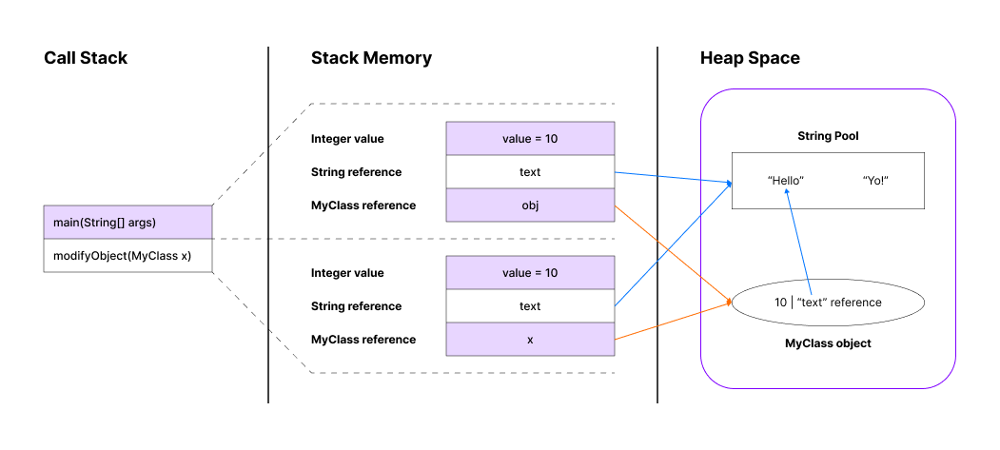
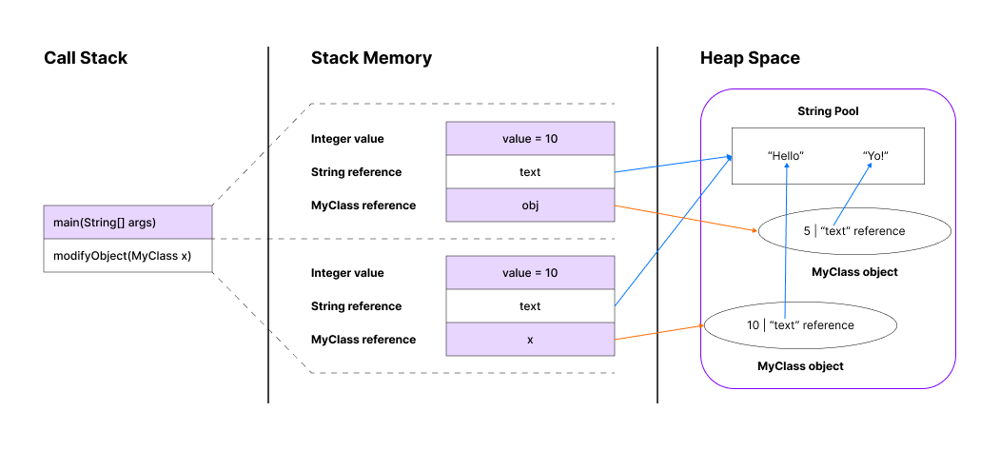

# Passing Reference Types
Given two different ways of passing reference types, and here's the explanation of the stack & heap memory process behind them.
## Case 1
```java
public class Main {
    public static void main(String[] args) {
        MyClass obj = new MyClass();
        obj.value = 5;
        obj.text = "Yo!";
        modifyObject(obj);

        System.out.println("obj.value after modfyObject: " + obj.value); // Output: 10
        System.out.println("obj.text after modfyObject: " + obj.text); // Output: Hello
    }

    public static void modifyObject(MyClass x) {
        x.value = 10;
        x.text = "Hello";
    }
}

class MyClass {
    int value;
    String text;
}
```

### Explanation:
In this case, `modifyObject` method modifies the fields of `MyClass` instance referred to by `obj`.

#### Memory Allocation:
1. **Stack Memory:**
    - When `main` method is called, a stack frame is created.
    - The reference `obj` is stored on the stack, pointing to a `MyClass` object in the heap.
    - When `modifyObject` is called, a new stack frame is created for it, with the parameter x referencing the same `MyClass` object as `obj`.
2. **Heap Memory:**
    - The new `MyClass()` instantiates an object of `MyClass` in the heap.
    - The fields `value` and `text` are part of this objec in the heap.

<br>



#### Process:
- The reference `obj` points to the `MyClass` object in the heap.
- The `modifyObject` method receives this reference and modifies the `value` and `text` fields of the same object in the heap.
- After returning from `modifyObject`, the changes are reflected in `obj` because `obj` and `x` point to the same object.

## Case 2
```java
public class Main {
    public static void main(String[] args) {
        MyClass obj = new MyClass();
        obj.value = 5;
        obj.text = "Yo!";
        changeReference(obj);

        System.out.println("obj.value after changeReference: " + obj.value); // Output: 5
        System.out.println("obj.text after changeReference: " + obj.text); // Output: Yo!
    }

    public static void changeReference(MyClass x) {
        x = new MyClass(); // This changes the local reference, not the original reference
        x.value = 10;
        x.text = "Hello";
    }
}

class MyClass {
    int value;
    String text;
}
```

### Explanation:
In this case, `changeReference` method assigns a new `MyClass` instance the parameter `x`, which does not affect the original referenc `obj`.

#### Memory Allocation:
1. **Stack Memory:**
    - When `main` method is called, a stack frame is created.
    - The reference `obj` is stored on the stack, pointing to a `MyClass` object in the heap.
    - When `changeReference` method is called, a new stack frame is created for it, with the parameter x initially referencing the same `MyClass` object as `obj`.
2. **Heap Memory:**
    - The new `MyClass()` instantiates an object of `MyClass` in the heap.
    - The second new `MyClass()` in `changeReference` creates a new `MyClass` object in the heap, but this is only referenced by the local variable `x` in `changeReference`.

<br>



#### Process:
- The reference `obj` points to the original `MyClass` object in the heap.
- The `changeReference` method receives this reference as `x`.
- Inside `changeReference`, `x = new MyClass()` creates a new `MyClass` object and reassigns `x` to reference this new object.
- The modifications `x.value = 10` and `x.text = "Hello"` are done on the new `MyClass` object.
- The original object referenced by `obj` remains unchanged since the reassignment of `x` does not affect `obj`.