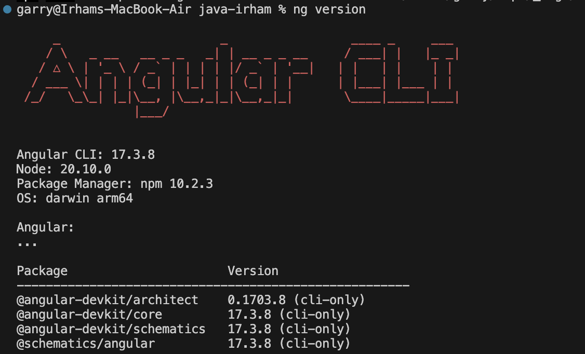
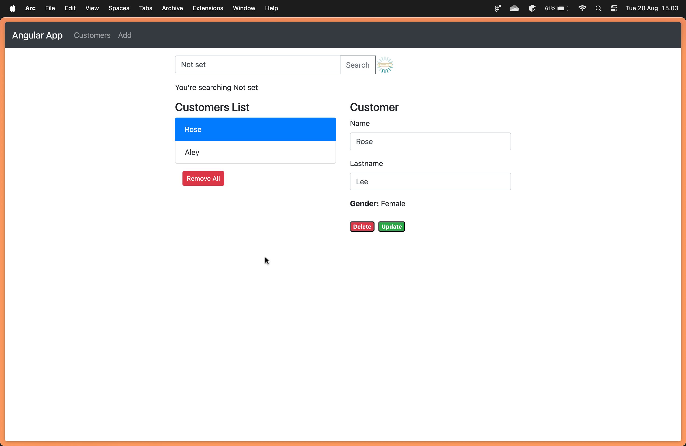

# Lecture 21 - Introductio to Angular

## Task 1 - Set Up Environment
Before we started, we need to install npm and angular. Currently, I used npm with version 10.2.3 and angular with version 17.3.8


## Task 2 - Run & Look into Code Structure
First, clone the repository: https://github.com/helenhash/angular-demo. Follow the instruction on the README.md and you will see the result like below.


## Task 3 - Component Lifecycle
Angular components go through several stages from creation to destruction. These stages are known as the component `lifecycle`. Understanding this lifecycle is crucial for managing component behavior, optimizing performance, and handling tasks like initialization and cleanup. Below is an explanation of each lifecycle hook provided by Angular.

### 1. **`ngOnChanges()`**

- **When:** Invoked whenever there is a change in the input properties bound to the component.
- **Purpose:** To respond to changes in input properties before the component is rendered.
- **Usage:** Useful when you need to act on input data as soon as it changes.
  
    ```typescript
    ngOnChanges(changes: SimpleChanges): void {
        console.log('Changes detected:', changes);
    }
    ```

### 2. `ngOnInit()`
- **When**: Called once after the first `ngOnChanges()` and just before the component is rendered.
- **Purpose**: To initialize the component after Angular has set the input properties.
- **Usage**: Ideal for fetching initial data and setting up component state.
    ```typescript
    ngOnInit(): void {
        console.log('Component Initialized');
    }
    ```


### 3. `ngDoCheck()`
- **When**: Called during every change detection cycle.
- **Purpose**: To detect and act upon changes that Angular’s default change detection doesn’t cover.
- **Usage**: Use cautiously to avoid performance hits as it runs frequently.
    ```typescript
    ngDoCheck(): void {
        console.log('Custom change detection logic');
    }
    ```

### 4. `ngAfterContentInit()`
- **When**: Called after Angular projects external content into the component’s view.
- **Purpose**: To act after the external content has been initialized.
- **Usage**: Suitable for logic that depends on the projected content.

    ```typescript
    ngAfterContentInit(): void {
        console.log('Content projected into the component');
    }
    ```

### 5. `ngAfterContentChecked()`
- **When**: Called after every check of the projected content.
- **Purpose**: To react to changes in the projected content.
- **Usage**: Similar to `ngDoCheck`, but for projected content.

    ```typescript
    ngAfterContentChecked(): void {
        console.log('Content has been checked');
    }
    ```

### 6. `ngAfterViewInit()`
- **When**: Called after Angular initializes the component’s views and child views.
- **Purpose**: To perform any additional initialization once the view is rendered.
- **Usage**: Useful for DOM-dependent operations.

    ```typescript
    ngAfterViewInit(): void {
        console.log('View and child views initialized');
    }
    ```

### 7. `ngAfterViewChecked()`
- **When**: Called after every check of the component’s views and child views.
- **Purpose**: To react to changes in the view and its children.
- **Usage**: Used for custom change detection on the component’s view.

    ```typescript
    ngAfterViewChecked(): void {
        console.log('View and child views checked');
    }
    ```

### 8. `ngOnDestroy()`
- **When**: Called just before Angular destroys the component.
- **Purpose**: To clean up resources, unsubscribe from observables, and perform other cleanup tasks.
- **Usage**: Essential for preventing memory leaks by unsubscribing from services or cleaning up event listeners.

    ```typescript
    ngOnDestroy(): void {
        console.log('Component about to be destroyed');
    }
    ```

