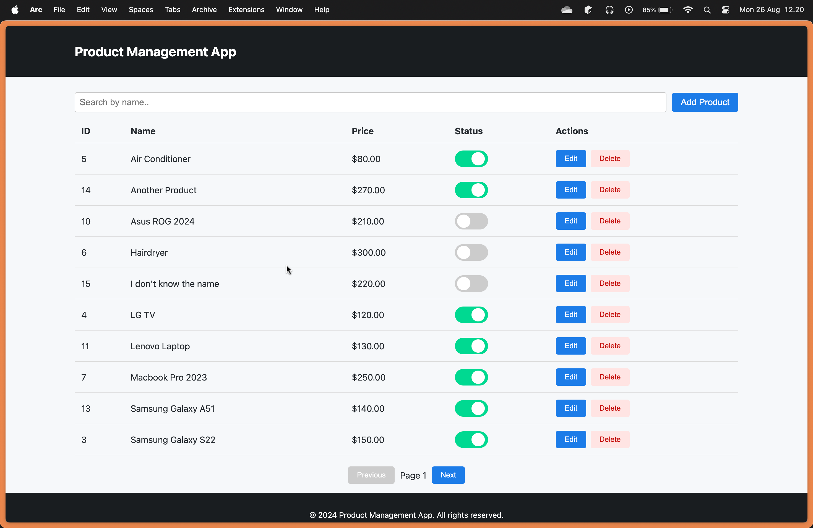
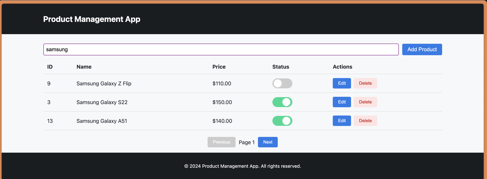
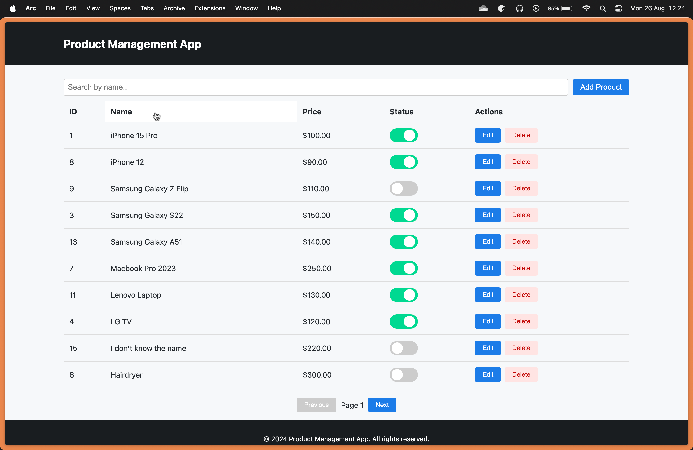
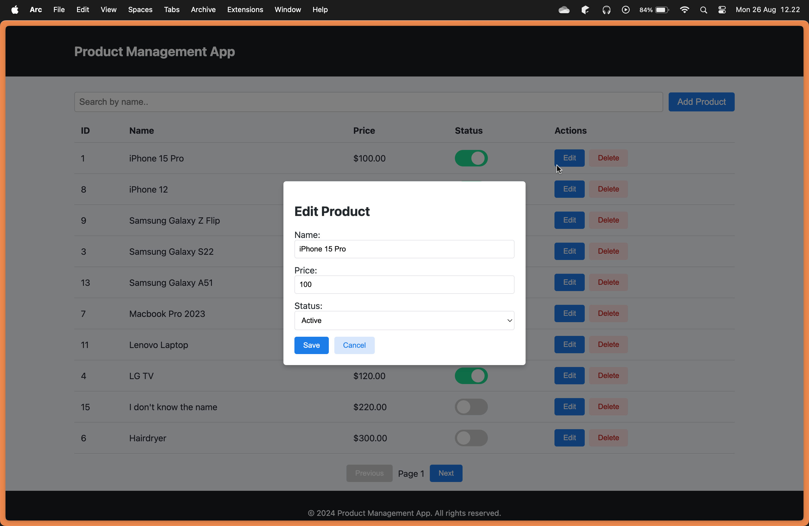
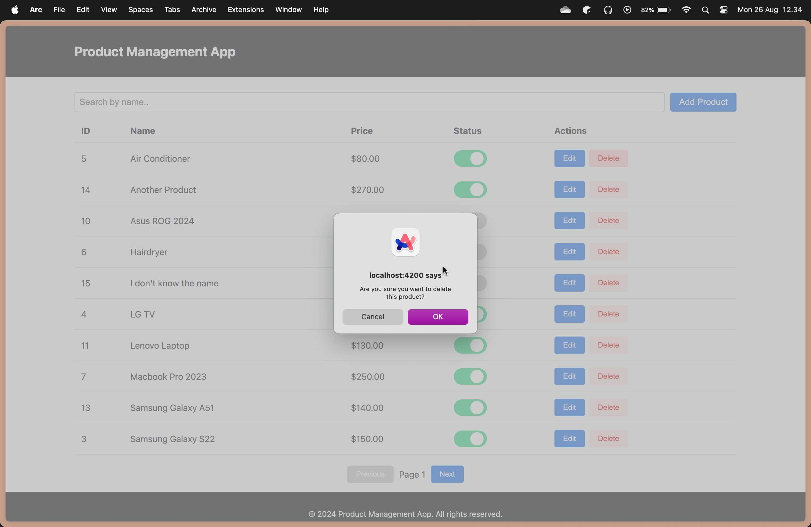

# Lecture 22 - Angular Base Project

To run the project:
1. Clone the [project](product-management).
2. Open the terminal and input `npm install` to install all the package.
3. Run the `npx json-server --watch db.json` to start the example server.
4. Run `ng serve` to run the project.

## Key Feature
### 1. List of Product with Pagination

### 2. Search Product

### 3. Sorting the List
To sort, click the header. You can sort it by the ID, Name, Price, and Status.

### 4. Add a Product

### 5. Edit a Product

### 6. Delete a Product
