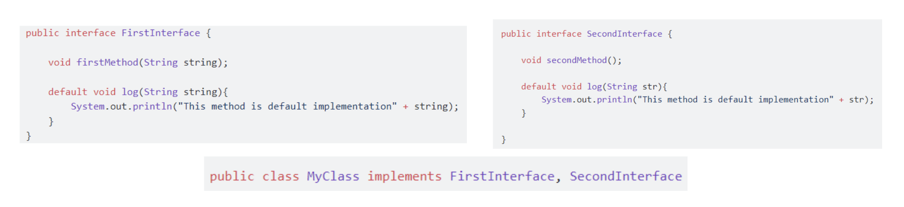
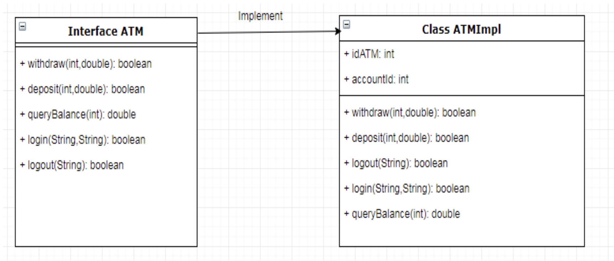

# What happen if implement 2 interface have same default method?


> 💡 When a class implements two interfaces that contain default methods with the same signature, it leads to a conflict. Java does not know which default method to use, and we need to provide an implementation for that method in our class to resolve the conflict.

### To resolve this:
We need to implement that method with `@Override`. We can implement it with its own way.
```java
public class MyClass implements FirstInterface, SecondInterface {
    @Override
    public void log(String str) {
        System.out.println("Resolved default method: " + str);
    }

    public static void main(String[] args) {
        MyClass myClass = new MyClass();
        myClass.log("with its own implementation"); // Output: Resolved default method: with its own implementation
    }
}
```

Or we also can call the implementation from the interface
```java
public class MyClass implements FirstInterface, SecondInterface {
    @Override
    public void log(String str) {
        SecondInterface.super.log(str);
    }

    public static void main(String[] args) {
        MyClass myClass = new MyClass();
        myClass.log("from second interface"); // Output: Resolved default method: from second interface
    }
}
```

<br>

# Abstract vs Interface
### Abstract
An abstract class is a class that cannot be instantiated on its own and is meant to be subclassed.

**Purposes**
> 🎯 Represent an abstract concept that can have both abstract and concrete methods. They provide a common base class that other classes can extend and share code.

> 🎯 Suitable when we want to share code among several closely related classes.

**Declaration:**
```java
public abstract class MyAbstractClass {
    // Abstract method (does not have a body)
    public abstract void abstractMethod();

    // Non-abstract method (has a body)
    public void concreteMethod() {
        System.out.println("This is a concrete method.");
    }
}
```

**Example:**
```java
public abstract class Animal {
    private String name;

    public Animal(String name) {
        this.name = name;
    }

    public abstract void makeSound(); // Abstract method

    public void sleep() { // Concrete method
        System.out.println(name + " is sleeping.");
    }

    public String getName() {
        return name;
    }
}

public class Dog extends Animal {
    public Dog(String name) {
        super(name);
    }

    @Override
    public void makeSound() {
        System.out.println(getName() + " says Woof!");
    }
}
```

### Interface
An interface is a reference type in Java that can contain only constants, method signatures, default methods, static methods, and nested types. Interfaces cannot contain instance fields or constructors.

**Purposes**
> 🎯 Interfaces are used to define a contract that other classes can implement. They provide a way to achieve abstraction and multiple inheritance in Java.

> 🎯 Suitable for defining a common behavior that can be implemented by classes from different inheritance trees.

**Declaration:**
```java
public interface MyInterface {
    // Abstract method (implicitly public and abstract)
    void abstractMethod();

    // Default method (has a body)
    default void defaultMethod() {
        System.out.println("This is a default method.");
    }

    // Static method (has a body)
    static void staticMethod() {
        System.out.println("This is a static method.");
    }
}
```

**Example:**
```java
public interface Animal {
    void makeSound(); // Abstract method

    default void sleep() { // Default method
        System.out.println("Animal is sleeping.");
    }
}

public class Dog implements Animal {
    private String name;

    public Dog(String name) {
        this.name = name;
    }

    @Override
    public void makeSound() {
        System.out.println(name + " says Woof!");
    }

    // Optionally, Dog can override the default method
    @Override
    public void sleep() {
        System.out.println(name + " is sleeping.");
    }
}
```

### Summary: Abstract vs Interface
| Feature                    | Abstract Class                          | Interface                              |
|----------------------------|-----------------------------------------|----------------------------------------|
| **Definition**             | A class that cannot be instantiated and must be inherited by other classes. | A reference type in Java, containing only constants, method signatures, default methods, static methods, and nested types. |
| **Declaration**            | `public abstract class MyClass`         | `public interface MyInterface`         |
| **Methods**                | Can have both abstract and concrete methods. | Can have abstract, default, and static methods. |
| **Attributes**             | Can have instance variables.            | Can have only public, static, and final constants. |
| **Constructor**            | Can have a constructor.                 | Cannot have a constructor.             |
| **Inheritance**            | Can inherit from one class and can be extended by one class. | Can implement multiple interfaces.     |
| **Method Implementation**  | Methods can have implementations.       | Abstract methods do not have implementations, default and static methods have implementations. |
| **Method Modifiers**       | Methods can have any access modifiers (public, protected, private). | Abstract methods are implicitly public. Default and static methods must be public. |
| **Purpose**                | Used for sharing code among closely related classes. | Used for defining a contract that can be implemented by any class, regardless of where it resides in the class hierarchy. |
| **Use Case**               | Use when you want to share common code among related classes. | Use when you want to define a common behavior that can be implemented by classes from different hierarchies. |

<br>

# @FunctionalInterface Annotation
`@FunctionalInterface` is an annotation in Java used to indicate that an interface is a functional interface. A **functional interface** is an interface that has **exactly one abstract method**, although it can have multiple default or static methods with implementations. Functional interfaces are crucial for enabling lambda expressions and method references, which were introduced in Java 8.

**Characteristics of a Functional Interface:**
1. **Single Abstract Method**: A functional interface has only one abstract method. This method is the single contract that must be implemented by any class that implements the interface.
2. **Can Have Default and Static Methods**: Besides the single abstract method, a functional interface can have default and static methods with implementations.
3. **Using @FunctionalInterface Annotation**: While not mandatory, it is highly recommended to use the @FunctionalInterface annotation to clearly indicate the intention and to allow the compiler to generate an error if the interface does not adhere to the functional interface rules.

**Example:**
```java
@FunctionalInterface
interface MyFunctionalInterface {
    void myMethod();
}
```
- The interface MyFunctionalInterface has a single abstract method myMethod().
- `@FunctionalInterface` annotation informs the compiler and the code readers that this interface is intended to be a functional interface. If you try to add a second abstract method, the compiler will generate an error.

### Lambda Expression
Functional interfaces support the use of lambda expressions, which allow for more concise and readable code.

**Example using Lambda Expression:**
```java
public class Main {
    public static void main(String[] args) {
        MyFunctionalInterface instance = () -> System.out.println("Hello, World!");
        instance.myMethod();
    }
}
```

- **Lambda Expression**: () -> System.out.println("Hello, World!") is the implementation of the myMethod() from MyFunctionalInterface.
- **Implementation**: The lambda expression is used to provide the implementation of the abstract method in the functional interface, making the code more concise and readable.

**Example of Functional Interface with Default and Static Methods:** 
```java
@FunctionalInterface
interface MyFunctionalInterface {
    void myMethod();

    default void defaultMethod() {
        System.out.println("This is a default method.");
    }

    static void staticMethod() {
        System.out.println("This is a static method.");
    }
}
```

- **Default Method**: `defaultMethod()` is a default method with an implementation.
- **Static Method**: `staticMethod()` is a static method with an implementation.
- **Abstract Method**: `myMethod()` remains the single abstract method that must be implemented.

# ATM Class Diagram Implementation


Click [here](Assignment2-4/src/App.java) to see the implementation.