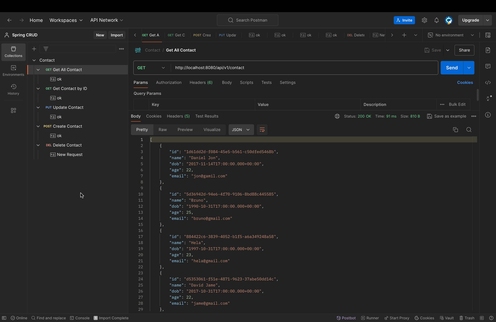
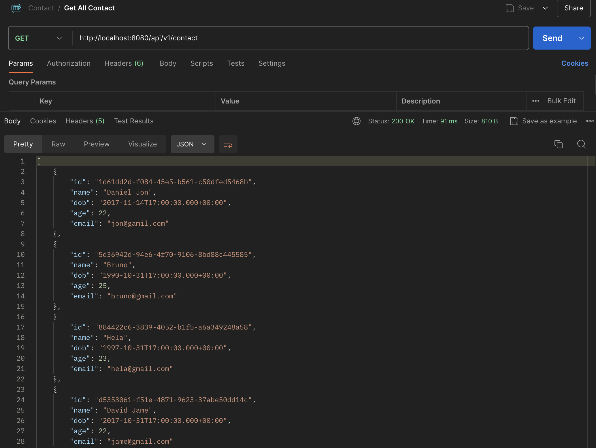
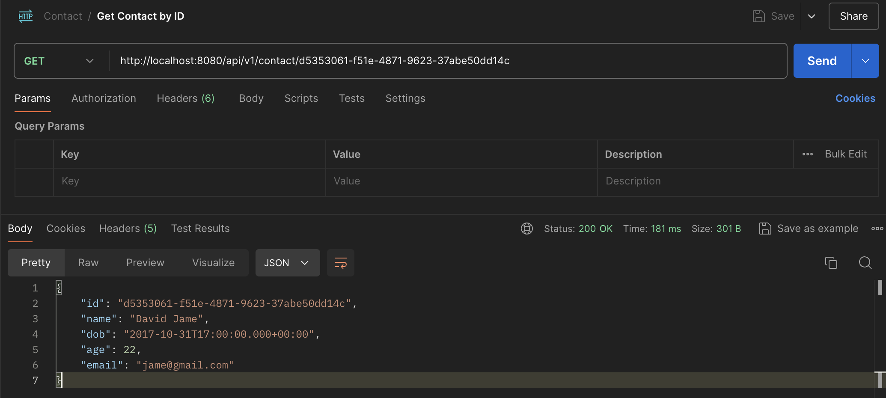
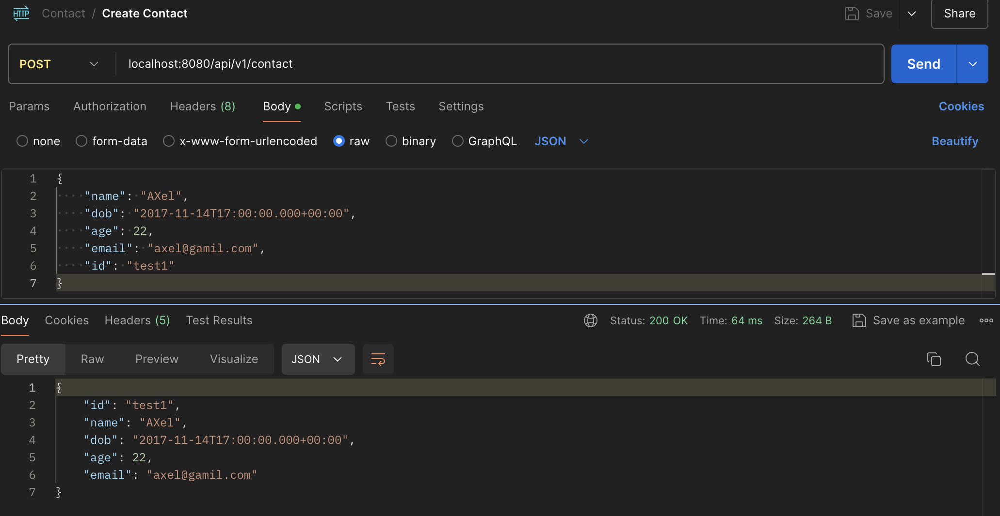
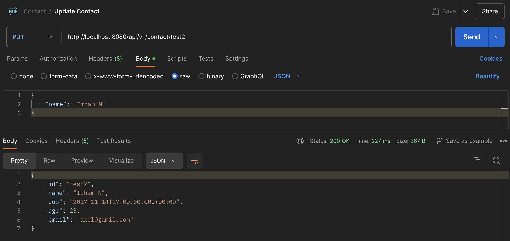
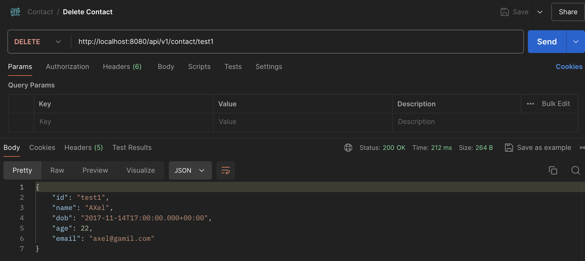

# Assignment 1
In this Assignment, I explored how to make a Java Spring project. You can access the project [here](unit_5/src/main/java/com/example/unit_5/Unit5Application.java).

## Results
### Postman

### Get All Contacts

### Get Contacts by ID

### Create Contact

### Update Contact

### Delete Contact
