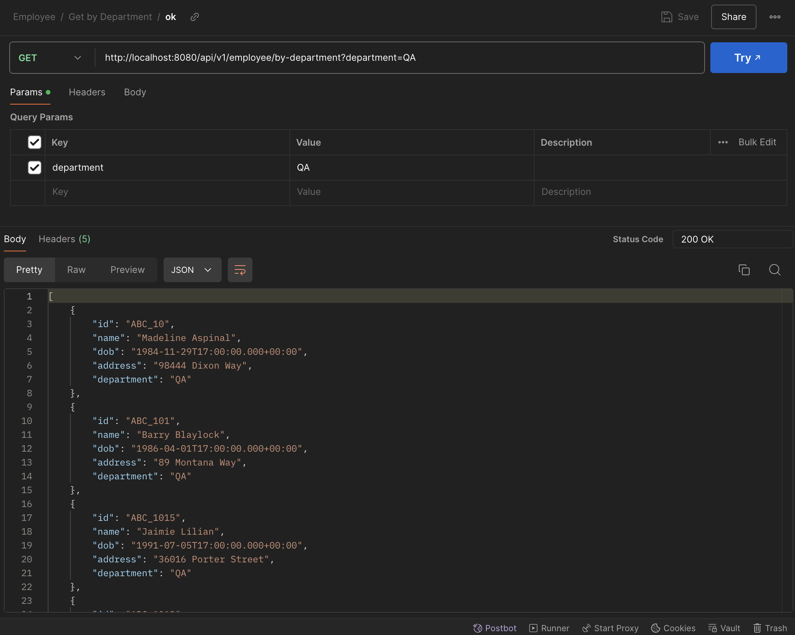

# Assignment 2
On this assignment, I explored how to create REST API using Java. You can check the project [here](employee-crud/src/main/java/com/findo/employee_crud/EmployeeCrudApplication.java).

## Model
[Employee.java](employee-crud/src/main/java/com/findo/employee_crud/model/Employee.java)
```java
@Getter
@Setter
@Entity
public class Employee {

    private static final long serialVersionUID = 1L;
    
    @Id
    private String id;
    private String name;
    private Date dob;
    private String address;
    private String department;
}
```
This code defines a Java class named `Employee` that is intended to be used as an entity in a JPA (Java Persistence API) context.

- `@Getter`: This annotation is from Lombok, a library that automatically generates getter methods for all fields in the class at compile time.

- `@Setter`: This annotation is also from Lombok and automatically generates setter methods for all fields in the class at compile time.

- `@Entity`: This annotation is from the jakarta.persistence package and marks this class as a JPA entity. This means that the class is mapped to a database table, and its instances represent rows in that table.

- `private static final long serialVersionUID = 1L;`: This field is used to ensure that the class is serializable. The `serialVersionUID` is a unique identifier for each version of a serializable class and is used during the deserialization process to verify that the sender and receiver of a serialized object maintain compatibility with respect to serialization.

- `@Id`: This annotation indicates that the id field is the primary key of the entity. The primary key is a unique identifier for each entity instance.


## Repository
[EmployeeRepository.java](employee-crud/src/main/java/com/findo/employee_crud/repository/EmployeeRepository.java)
```java
@Repository
public interface EmployeeRepository extends JpaRepository<Employee, String> {
    List<Employee> findByDepartment(String department);
}
```
This code defines a repository interface for managing `Employee` entities in a Spring Boot application.

- `@Repository`: This annotation is used to indicate that the interface is a Spring Data Repository. It marks the interface as a candidate for Spring's component scanning to detect and create a bean for dependency injection.

- `public interface EmployeeRepository`: This defines an interface named EmployeeRepository. In Java, interfaces are used to specify methods that a class must implement.

- `extends JpaRepository<Employee, String>`: This indicates that `EmployeeRepository` extends the `JpaRepository` interface provided by Spring Data JPA. By extending `JpaRepository`, `EmployeeRepository` inherits several methods for working with `Employee` persistence, including methods for saving, deleting, and finding `Employee` entities.

## Controller
You can check the full code on [EmployeeController.java](employee-crud/src/main/java/com/findo/employee_crud/controller/EmployeeController.java) file.

### Upload CSV API
```java
    @PostMapping("/upload")
    public ResponseEntity<List<Employee>> uploadCsvFile(@RequestParam("file") MultipartFile file) {
        List<Employee> employees = new ArrayList<>();
        try (Reader reader = new BufferedReader(new InputStreamReader(file.getInputStream(), StandardCharsets.UTF_8))) {
            CSVFormat csvFormat = CSVFormat.Builder.create()
                .setHeader("ID", "Name", "DateOfBirth", "Address", "Department")
                .setSkipHeaderRecord(true)
                .build();

            try (CSVParser csvParser = new CSVParser(reader, csvFormat)) {
                for (CSVRecord csvRecord : csvParser) {
                    Employee employee = new Employee();
                    employee.setId(csvRecord.get("ID"));
                    employee.setName(csvRecord.get("Name"));
                    employee.setDob(new SimpleDateFormat("dd/MM/yyyy").parse(csvRecord.get("DateOfBirth")));
                    employee.setAddress(csvRecord.get("Address"));
                    employee.setDepartment(csvRecord.get("Department"));
                    employees.add(employee);
                }
            }

            repository.saveAll(employees);
            return ResponseEntity.ok(employees);

        } catch (Exception e) {
            return ResponseEntity.status(500).build();
        }
    }
```
This code defines a Spring Boot REST controller method that handles the uploading and processing of a CSV file containing employee data.

- `@PostMapping("/upload")`: This annotation maps HTTP POST requests to /upload to this method.

- `public ResponseEntity<List<Employee>> uploadCsvFile(@RequestParam("file") MultipartFile file)`: This method accepts a CSV file uploaded as a `MultipartFile` via an HTTP POST request. It returns a ResponseEntity containing a list of `Employee` objects.

- `try (Reader reader = new BufferedReader(new InputStreamReader(file.getInputStream(), StandardCharsets.UTF_8)))`: This block reads the CSV file content using a Reader with UTF-8 encoding.

- `CSVFormat csvFormat = CSVFormat.Builder.create() .setHeader("ID", "Name", "DateOfBirth", "Address", "Department") .setSkipHeaderRecord(true) .build();`: This block configures the CSV format, setting the header and skipping the first record (header row).

- `try (CSVParser csvParser = new CSVParser(reader, csvFormat))`: This block parses the CSV file content using the configured CSV format.

#### Results


### Get Employee by Department
```java
    @GetMapping("/by-department")
    public ResponseEntity<List<Employee>> getEmployeesByDepartment(@RequestParam("department") String department) {
        List<Employee> employees = repository.findByDepartment(department);
        if (employees.isEmpty()) {
            return ResponseEntity.noContent().build();
        }
        return ResponseEntity.ok(employees);
    }
```
This code defines a Spring Boot REST controller method that handles GET requests to retrieve employees by their department.

- `@GetMapping("/by-department")`: This annotation maps HTTP GET requests to `/by-department` to this method.

- `public ResponseEntity<List<Employee>> getEmployeesByDepartment(@RequestParam("department") String department)`: This method accepts a department query parameter and returns a `ResponseEntity` containing a list of `Employee` objects.

- `@RequestParam("department") String department`: This annotation binds the value of the department query parameter from the request URL to the department method parameter.

- `List<Employee> employees = repository.findByDepartment(department);`: This line calls the `findByDepartment` method of the `EmployeeRepository` to retrieve a list of employees that belong to the specified department.

- `if (employees.isEmpty())`: This condition checks if the list of employees is empty.

- `return ResponseEntity.noContent().build();`: If the list is empty, it returns an HTTP 204 No Content response, indicating that there are no employees in the specified department.

- `return ResponseEntity.ok(employees);`: If the list is not empty, it returns an HTTP 200 OK response with the list of employees in the specified department.

#### Results


## Basic CRUD API
### Create Employee


### Get All Employees


### Get Employee by ID


### Update Employee


### Delete Employee
