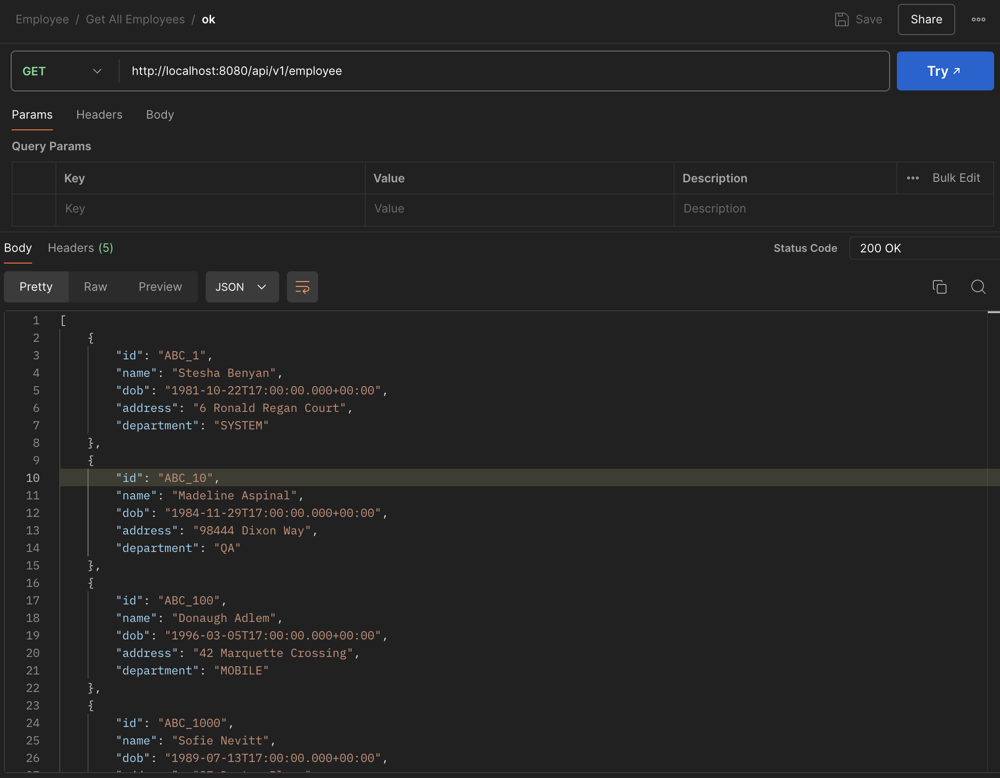

# Assignment 2
On this assignment, I explored how to create REST API using Java. You can check the project [here](employee-crud/src/main/java/com/findo/employee_crud/EmployeeCrudApplication.java).

## Model
[Employee.java](employee-crud/src/main/java/com/findo/employee_crud/model/Employee.java)
```java
@Getter
@Setter
@Entity
public class Employee {

    private static final long serialVersionUID = 1L;
    
    @Id
    private String id;
    private String name;
    private Date dob;
    private String address;
    private String department;
}
```
This code defines a Java class named `Employee` that is intended to be used as an entity in a JPA (Java Persistence API) context.

- `@Getter`: This annotation is from Lombok, a library that automatically generates getter methods for all fields in the class at compile time.

- `@Setter`: This annotation is also from Lombok and automatically generates setter methods for all fields in the class at compile time.

- `@Entity`: This annotation is from the jakarta.persistence package and marks this class as a JPA entity. This means that the class is mapped to a database table, and its instances represent rows in that table.

- `private static final long serialVersionUID = 1L;`: This field is used to ensure that the class is serializable. The `serialVersionUID` is a unique identifier for each version of a serializable class and is used during the deserialization process to verify that the sender and receiver of a serialized object maintain compatibility with respect to serialization.

- `@Id`: This annotation indicates that the id field is the primary key of the entity. The primary key is a unique identifier for each entity instance.


## Repository
[EmployeeRepository.java](employee-crud/src/main/java/com/findo/employee_crud/repository/EmployeeRepository.java)
```java
@Repository
public interface EmployeeRepository extends JpaRepository<Employee, String> {
    @Query("SELECT e FROM Employee e WHERE e.name LIKE %:query% OR e.address LIKE %:query% OR e.department LIKE %:query%")
    List<Employee> searchEmployees(@Param("query") String query);
}
```
### Repository Interface Declaration
- `@Repository`: This annotation indicates that the interface is a Spring Data repository. It is a specialized component that provides CRUD operations for the entity.
- `public interface EmployeeRepository`: This declares an interface named `EmployeeRepository`.
- `extends JpaRepository<Employee, String>`: This interface extends `JpaRepository`, which is a Spring Data interface for generic CRUD operations. The `Employee` entity type is specified, and `String` is used as the type for the entity's ID.

### Custom Query Method
- `@Query`: This annotation defines a custom query using JPQL (Java Persistence Query Language). The query will be executed when the method searchEmployees is called.
- `List<Employee> searchEmployees(@Param("query") String query)`: This method signature defines a custom method to search for employees based on a query string. It returns a list of Employee objects that match the search criteria.
- `@Param("query") String` query: This annotation binds the method parameter query to the named parameter :query in the JPQL query.

### JPQL Query
- `SELECT e FROM Employee e`: This part of the query selects all Employee entities from the database.
- `WHERE e.name LIKE %:query% OR e.address LIKE %:query% OR e.department LIKE %:query%`: This specifies the condition for the query. It uses the LIKE operator to match the query string with the name, address, and department fields of the Employee entity. The % characters are wildcards that allow partial matches. The query string is surrounded by % on both sides to find any employees whose name, address, or department contains the query string.

## Controller
You can check the full code on [EmployeeController.java](employee-crud/src/main/java/com/findo/employee_crud/controller/EmployeeController.java) file.

### Upload CSV API
```java
    @PostMapping("/upload")
    public ResponseEntity<List<Employee>> uploadCsvFile(@RequestParam("file") MultipartFile file) {
        List<Employee> employees = new ArrayList<>();
        try (Reader reader = new BufferedReader(new InputStreamReader(file.getInputStream(), StandardCharsets.UTF_8))) {
            CSVFormat csvFormat = CSVFormat.Builder.create()
                .setHeader("ID", "Name", "DateOfBirth", "Address", "Department")
                .setSkipHeaderRecord(true)
                .build();

            try (CSVParser csvParser = new CSVParser(reader, csvFormat)) {
                for (CSVRecord csvRecord : csvParser) {
                    Employee employee = new Employee();
                    employee.setId(csvRecord.get("ID"));
                    employee.setName(csvRecord.get("Name"));
                    employee.setDob(new SimpleDateFormat("dd/MM/yyyy").parse(csvRecord.get("DateOfBirth")));
                    employee.setAddress(csvRecord.get("Address"));
                    employee.setDepartment(csvRecord.get("Department"));
                    employees.add(employee);
                }
            }

            repository.saveAll(employees);
            return ResponseEntity.ok(employees);

        } catch (Exception e) {
            return ResponseEntity.status(500).build();
        }
    }
```
This code defines a Spring Boot REST controller method that handles the uploading and processing of a CSV file containing employee data.

- `@PostMapping("/upload")`: This annotation maps HTTP POST requests to /upload to this method.

- `public ResponseEntity<List<Employee>> uploadCsvFile(@RequestParam("file") MultipartFile file)`: This method accepts a CSV file uploaded as a `MultipartFile` via an HTTP POST request. It returns a ResponseEntity containing a list of `Employee` objects.

- `try (Reader reader = new BufferedReader(new InputStreamReader(file.getInputStream(), StandardCharsets.UTF_8)))`: This block reads the CSV file content using a Reader with UTF-8 encoding.

- `CSVFormat csvFormat = CSVFormat.Builder.create() .setHeader("ID", "Name", "DateOfBirth", "Address", "Department") .setSkipHeaderRecord(true) .build();`: This block configures the CSV format, setting the header and skipping the first record (header row).

- `try (CSVParser csvParser = new CSVParser(reader, csvFormat))`: This block parses the CSV file content using the configured CSV format.

#### Results


### Get Employees
On this API, I customize it to handle query. So, user can search employees by name, department, or address.

```java
    @GetMapping
    public ResponseEntity<List<Employee>> getEmployees(@RequestParam(value = "query", required = false) String query) {
        List<Employee> employees;

        if (query != null && !query.isEmpty()) {
            employees = repository.searchEmployees(query);
        } else {
            employees = repository.findAll();
        }

        if (employees.isEmpty()) {
            return ResponseEntity.noContent().build();
        }
        return ResponseEntity.ok(employees);
    }
```
- `@GetMapping`: This annotation indicates that the method should handle HTTP GET requests. The endpoint for this method is the root URL of the controller's mapping.
- `public ResponseEntity<List<Employee>> getEmployees(@RequestParam(value = "query", required = false) String query)`: This method returns a ResponseEntity containing a list of Employee objects. The method takes an optional query parameter named query.
- `List<Employee> employees;`: This declares a list to hold the employee records.
- `employees = repository.searchEmployees(query);`: If the query parameter is provided and not empty, it calls the searchEmployees method from the `EmployeeRepository` to search for employees matching the query.
- `employees = repository.findAll();`: If the query parameter is not provided or empty, it fetches all employee records from the repository using the findAll method.

#### Results
**Get All Employee (without query)**


**With Query**

On this example, I tried to search employees that contains **"dex"**.


## Basic CRUD API
### Create Employee


### Get Employee by ID


### Update Employee


### Delete Employee
