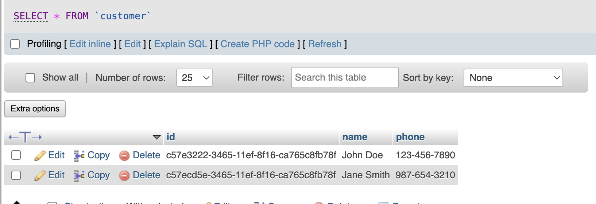

# Assignment 2: Store Invoice Management Application

A store wants to have an application to manage invoices and be able to see daily, monthly, and annual revenue. Below are the SQL commands to create the necessary tables for this application. The tables include `customer`, `cashier`, `invoice`, `invoice_detail`, and `product`.

## Initialize Database

First, we initialize the database. On this assignment, I use MySQL. Below are codes to create table for MySQL.

### Customer Table

```sql
CREATE TABLE customer (
    id CHAR(36) PRIMARY KEY DEFAULT (UUID()),
    name VARCHAR(255) NOT NULL,
    phone VARCHAR(20) NOT NULL
);
```

### Cashier Table

```sql
CREATE TABLE cashier (
    id CHAR(36) PRIMARY KEY DEFAULT (UUID()),
    name VARCHAR(255) NOT NULL
);
```

### Product Table
```sql
CREATE TABLE product (
    id CHAR(36) PRIMARY KEY DEFAULT (UUID()),
    name VARCHAR(255) NOT NULL,
    price DECIMAL(10, 2) NOT NULL
);
```

### Invoice Table
```sql
CREATE TABLE invoice (
    id CHAR(36) PRIMARY KEY DEFAULT (UUID()),
    customer_id CHAR(36) NOT NULL,
    cashier_id CHAR(36) NOT NULL,
    amount DECIMAL(10, 2) NOT NULL,
    created_date TIMESTAMP NOT NULL DEFAULT CURRENT_TIMESTAMP,
    FOREIGN KEY (customer_id) REFERENCES customer(id),
    FOREIGN KEY (cashier_id) REFERENCES cashier(id)
);
```

### Invoice Detail Table

```sql
CREATE TABLE invoice_detail (
    id CHAR(36) PRIMARY KEY DEFAULT (UUID()),
    quantity INT NOT NULL,
    product_id CHAR(36) NOT NULL,
    product_price DECIMAL(10, 2) NOT NULL,
    invoice_id CHAR(36) NOT NULL,
    amount DECIMAL(10, 2) AS (quantity * product_price) STORED,
    FOREIGN KEY (product_id) REFERENCES product(id),
    FOREIGN KEY (invoice_id) REFERENCES invoice(id)
);
```

## Add Sample Data
Next, we add sample data to created table. Below are the code for add data to the table.

### Insert Sample Data into Customer Table
```sql
INSERT INTO customer (id, name, phone) VALUES
(UUID(), 'John Doe', '123-456-7890'),
(UUID(), 'Jane Smith', '987-654-3210');
```

#### Result


### Insert Sample Data into Cashier Table
```sql
INSERT INTO cashier (id, name) VALUES
(UUID(), 'Alice Brown'),
(UUID(), 'Bob Johnson');
```

#### Result


### Insert Sample Data into Product Table
```sql
INSERT INTO product (id, name, price) VALUES
(UUID(), 'Product A', 10.00),
(UUID(), 'Product B', 20.00),
(UUID(), 'Product C', 30.00);
```

#### Result


### Insert Sample Data into Invoice Table
```sql
-- Assuming the amount is calculated as the sum of the related invoice_detail.amount
-- For simplicity, using direct values here

INSERT INTO invoice (id, customer_id, cashier_id, amount) VALUES
-- Replace UUID values with actual UUIDs generated from the previous inserts
(UUID(), 'customer-uuid-1', 'cashier-uuid-1', 100.00),
(UUID(), 'customer-uuid-2', 'cashier-uuid-2', 200.00);
```

#### Result


### Insert Sample Data into Invoice Detail Table
```sql
INSERT INTO invoice_detail (id, quantity, product_id, product_price, invoice_id) VALUES
-- Replace UUID values with actual UUIDs generated from the previous inserts
(UUID(), 2, 'product-uuid-1', 10.00, 'invoice-uuid-1'),
(UUID(), 3, 'product-uuid-2', 20.00, 'invoice-uuid-1'),
(UUID(), 1, 'product-uuid-3', 30.00, 'invoice-uuid-2'),
(UUID(), 4, 'product-uuid-1', 10.00, 'invoice-uuid-2');
```

#### Result


## Calculate Invoice Amounts
To ensure that the `amount` in the `invoice` table is the sum of `amount` in the related `invoice_detail` table, you can use the following query to update the invoice amounts:
```sql
UPDATE invoice i SET amount = (
    SELECT SUM(amount)
    FROM invoice_detail id
    WHERE id.invoice_id = i.id
);
```

## Queries for Revenue
### Daily Revenue
```sql
SELECT DATE(created_date) AS day, SUM(amount) AS daily_revenue
FROM invoice
GROUP BY DATE(created_date);
```

#### Results


### Monthly Revenue
```sql
SELECT DATE_FORMAT(created_date, '%Y-%m') AS month, SUM(amount) AS monthly_revenue
FROM invoice
GROUP BY DATE_FORMAT(created_date, '%Y-%m');
```

#### Results


### Annual Revenue
```sql
SELECT YEAR(created_date) AS year, SUM(amount) AS annual_revenue
FROM invoice
GROUP BY YEAR(created_date);
```

#### Results
