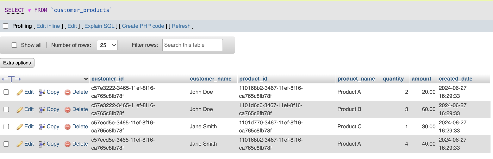
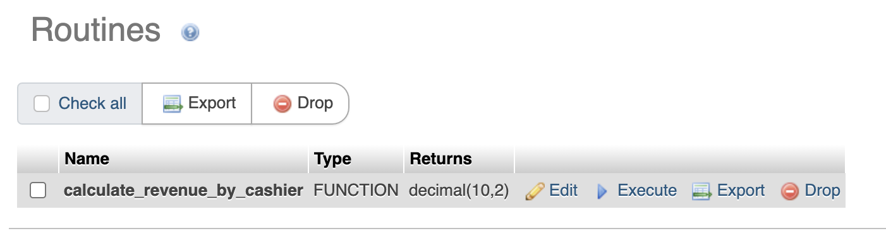
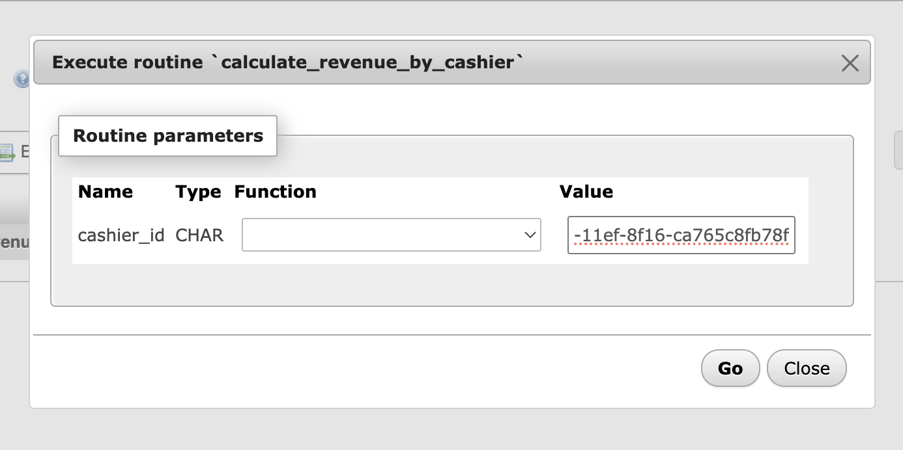
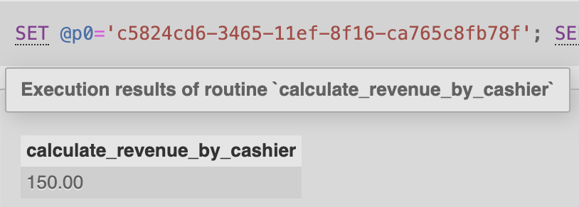
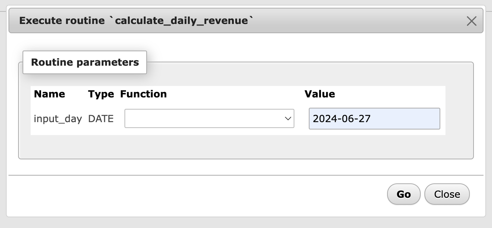
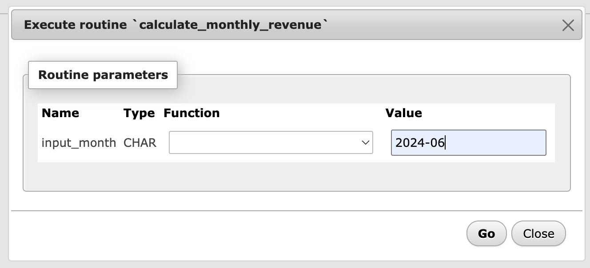
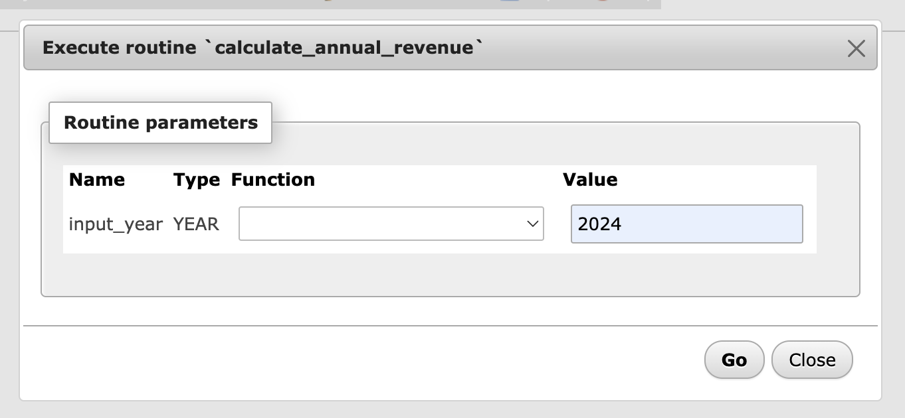
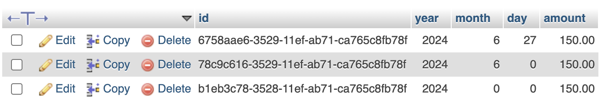

# Assignment 3

On this assignment, I explored the steps to create a view, function, table, and stored procedures for managing and reporting revenue in a MySQL database.

## Create View: Customer Products

The view `customer_products` lists the products bought by customers, including details such as customer ID, customer name, product ID, product name, quantity, amount, and the date of purchase.

### SQL to Create the View

```sql
CREATE VIEW customer_products AS
SELECT
    c.id AS customer_id,
    c.name AS customer_name,
    p.id AS product_id,
    p.name AS product_name,
    id.quantity,
    id.amount,
    i.created_date
FROM
    customer c
    JOIN invoice i ON c.id = i.customer_id
    JOIN invoice_detail id ON i.id = id.invoice_id
    JOIN product p ON id.product_id = p.id;
```

### Results


## Create Function: Calculate Revenue by Cashier

The function `calculate_revenue_by_cashier` calculates the total revenue generated by a specific cashier.

### SQL to Create the Function
```sql
DELIMITER $$

CREATE FUNCTION calculate_revenue_by_cashier(cashier_id CHAR(36))
RETURNS DECIMAL(10, 2)
BEGIN
    DECLARE revenue DECIMAL(10, 2);
    SELECT SUM(amount) INTO revenue
    FROM invoice
    WHERE cashier_id = cashier_id;
    RETURN revenue;
END$$

DELIMITER ;
```

### Results
Now we have `calculate_revenue_by_cashier` function.


Click on the `Execute` button. We can input the cashier id here.


#### Output


## Create Table: Revenue Report
The table revenue_report stores the revenue data, including year, month, day, and the total amount.

### SQL to Create the Table
```sql
CREATE TABLE revenue_report (
    id CHAR(36) PRIMARY KEY DEFAULT (UUID()),
    year INT NOT NULL,
    month INT NOT NULL,
    day INT NOT NULL,
    amount DECIMAL(10, 2) NOT NULL
);
```

## Create Stored Procedure
### Calculate Daily Revenue
The stored procedure `calculate_daily_revenue` calculates and stores the revenue for a given day in the revenue_report table.

```sql
DELIMITER $$

CREATE PROCEDURE calculate_daily_revenue(IN input_day DATE)
BEGIN
    DECLARE daily_revenue DECIMAL(10, 2);

    SELECT SUM(amount) INTO daily_revenue
    FROM invoice
    WHERE DATE(created_date) = input_day;

    INSERT INTO revenue_report (id, year, month, day, amount)
    VALUES (UUID(), YEAR(input_day), MONTH(input_day), DAY(input_day), daily_revenue);
END$$

DELIMITER ;
```

#### Input
Input format: `YYYY-MM-DD`


### Calculate Monthly Revenue
The stored procedure calcula`te_monthly_revenue calculates and stores the revenue for a given month in the revenue_report table.

```sql
DELIMITER $$

CREATE PROCEDURE calculate_monthly_revenue(IN input_month CHAR(7))
BEGIN
    DECLARE monthly_revenue DECIMAL(10, 2);

    SELECT SUM(amount) INTO monthly_revenue
    FROM invoice
    WHERE DATE_FORMAT(created_date, '%Y-%m') = input_month;

    INSERT INTO revenue_report (id, year, month, day, amount)
    VALUES (UUID(), LEFT(input_month, 4), RIGHT(input_month, 2), 0, monthly_revenue);
END$$

DELIMITER ;
```

#### Input
Input format: `YYYY-MM`


### Calculate Annual Revenue
The stored procedure `calculate_annual_revenue` calculates and stores the revenue for a given year in the revenue_report table.

```sql
DELIMITER $$

CREATE PROCEDURE calculate_annual_revenue(IN input_year YEAR)
BEGIN
    DECLARE annual_revenue DECIMAL(10, 2);

    SELECT SUM(amount) INTO annual_revenue
    FROM invoice
    WHERE YEAR(created_date) = input_year;

    INSERT INTO revenue_report (id, year, month, day, amount)
    VALUES (UUID(), input_year, 0, 0, annual_revenue);
END$$

DELIMITER ;
```

#### Input
Input format: `YYYY`


### Procedure Output


## REST API Best Practice
Here's the best practice to implement REST API: https://stackoverflow.blog/2020/03/02/best-practices-for-rest-api-design/#h-accept-and-respond-with-json

Based on the article, here's the comparison to the previous assignment (Unit 5 - Assignment 2).

| No. |            Aspect                            |  Checklist |
|-----|----------------------------------------------|------------|
| 1. | Accept and respond with JSON                 |     ✅     |
| 2. | Use nouns instead of verbs in endpoint paths |     ✅     |
| 3. | Use logical nesting on endpoints             |     ✅     |
| 4. | Handle errors gracefully and return standard error codes |     ✅     |
| 5. | Allow filtering                              |     ✅     |
| 6. | Allow sorting                                |     ❌     |
| 7. | Allow pagination                             |     ❌     |
| 8. | Maintain good security practices             |     ❌     |
| 9. | Cache data to improve performance            |     ❌     |
| 10. | Versioning APIs                             |     ✅     |