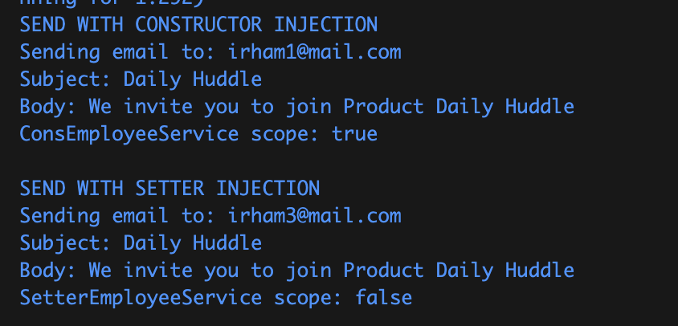
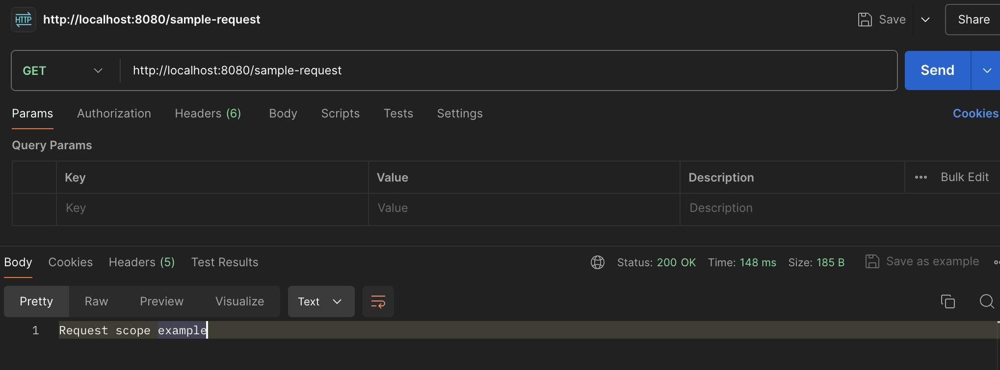

# Assignment 3
## Task 1: Add bean scopes (singleton, prototype)
### [ConsEmployeeService.java](lab/src/main/java/fpt/lab/service/ConsEmployeeService.java)
First, I modified the `ConsEmployeeService` class by adding the `@Scope` annotation. Though by default it will give the `singleton` value, I explicitly give it a `singleton` value.
```java
@Service
@Scope("singleton")
public class ConsEmployeeService {
    
    private final EmailService emailService;

    public ConsEmployeeService(EmailService emailService) {
        this.emailService = emailService;
    }

    public void notifyEmployee(String employeeEmail) {
        System.out.println("SEND WITH CONSTRUCTOR INJECTION");
        emailService.sendEmail(
            employeeEmail,
            "Daily Huddle", 
            "We invite you to join Product Daily Huddle");
    }
}
```


### [SetterEmployeeService.java](lab/src/main/java/fpt/lab/service/SetterEmployeeService.java)
On the other hand, I add `prototype` value to the `SetterEmployeeService` class.
```java
@Service
@Scope("prototype")
public class SetterEmployeeService {
    
    private EmailService emailService;

    @Autowired
    public void setEmailService(EmailService emailService) {
        this.emailService = emailService;
    }

    public void notifyEmployee(String employeeEmail) {
        System.out.println("SEND WITH SETTER INJECTION");
        emailService.sendEmail(
            employeeEmail,
            "Daily Huddle", 
            "We invite you to join Product Daily Huddle");
    }
}
```

### [LabApplication](lab/src/main/java/fpt/lab/LabApplication.java)
On the main class, let's call method from both `ConsEmployeeService` and `SetterEmployeeService`. I created two objects from each class and print their bean scope by check if their objects are the same or no.
```java
@SpringBootApplication
public class LabApplication {

	public static void main(String[] args) {
		SpringApplication.run(LabApplication.class, args);

		ApplicationContext context = new AnnotationConfigApplicationContext(AppConfig.class);

        // Testing Constructor Injection
        ConsEmployeeService consEmployeeService1 = context.getBean(ConsEmployeeService.class);
        consEmployeeService1.notifyEmployee("irham1@mail.com");

        ConsEmployeeService consEmployeeService2 = context.getBean(ConsEmployeeService.class);
        // Check if each objects have the same bean scope
        System.out.println("ConsEmployeeService scope: " + (consEmployeeService1 == consEmployeeService2) + "\n");

        // Testing Setter Injection
        SetterEmployeeService setterEmployeeService1 = context.getBean(SetterEmployeeService.class);
        setterEmployeeService1.notifyEmployee("irham3@mail.com");

        SetterEmployeeService setterEmployeeService2 = context.getBean(SetterEmployeeService.class);
        // Check if each objects have the same bean scope
        System.out.println("SetterEmployeeService scope: " + (setterEmployeeService1 == setterEmployeeService2) + "\n");
	}
}
```

### Output

From the output we can see that the class with `singleton` scope is getting the same bean scope whenever its created. Otherwise, the class with `prototype` scope is getting different bean scope.

## Task 2: Create a controller and test it
### [SampleController.java](lab/src/main/java/fpt/lab/controller/SampleController.java)
First, I created a controller with `sample-request` endpoint.
I used the `@Controller` annotation to specify that this class is a Spring Controller, so it will be automatically stored in the Controller scope. Unlike other class, if we use the `@Controller` annotation and run the project, this class will be stored in the Controller automatically without have to be called in main class.
```java
@Controller
@RequestMapping("/sample-request")
public class SampleController {
    
    private final EmailService emailService;

    public SampleController(EmailService emailService) {
        this.emailService = emailService;
    }

    @GetMapping
    @ResponseBody
    public String handleRequest() {
        emailService.sendEmail("request@sample.com", "Request Scope Sample", "This is a request scoped sample email.");
        return "Request scope example";
    }
}
```

### Output
To test it, let's request the API with url: `http://localhost:8080/sample-request`. And if it's succeed, the result will be shown like this.


## Task 3: How to inject prototype Bean into singleton Bean?
In Spring, beans can have different scopes, such as `singleton` and `prototype`. A `singleton` bean is created once per Spring IoC container, while a `prototype` bean is created each time it is requested. Injecting a prototype bean into a singleton bean can be tricky because the singleton bean will only receive one instance of the prototype bean, defeating the purpose of the prototype scope.

To properly inject a prototype-scoped bean into a singleton-scoped bean, you can use one of the following methods:
1. **ObjectFactory**
2. **Provider**

### Method 1: Using ObjectFactory

`ObjectFactory` is a functional interface provided by Spring that allows you to get a new instance of a bean when needed.

#### Example

```java
@Service
public class ConsEmployeeService {

    private final ObjectFactory<EmailService> emailServiceFactory;

    public ConsEmployeeService(ObjectFactory<EmailService> emailServiceFactory) {
        this.emailServiceFactory = emailServiceFactory;
    }

    public void notifyEmployee(String employeeEmail) {
        EmailService emailService = emailServiceFactory.getObject();
        System.out.println("Sent with Constructor Injection");
        emailService.sendEmail(employeeEmail, "Daily Huddle", "We invite you to join Product Daily Huddle");
    }
}
```

### Method 2: Using Provider
`Provider` is an interface from JSR-330 (Dependency Injection for Java) that can be used to get a new instance of a bean when needed.

#### Example
```java
@Service
public class ConsEmployeeService {

    private final Provider<EmailService> emailServiceProvider;

    @Autowired
    public ConsEmployeeService(Provider<EmailService> emailServiceProvider) {
        this.emailServiceProvider = emailServiceProvider;
    }

    public void notifyEmployee(String employeeEmail) {
        EmailService emailService = emailServiceProvider.get();
        System.out.println("Sent with Constructor Injection");
        emailService.sendEmail(employeeEmail, "Daily Huddle", "We invite you to join Product Daily Huddle");
    }
}
```

## Task 4: Diference between BeanFactory and ApplicationContext
In Spring, both `BeanFactory` and `ApplicationContext` are interfaces that provide the fundamental capabilities for dependency injection. However, they differ in terms of features and usage.

### BeanFactory
- `BeanFactory` is the root interface for accessing the Spring container.
- It provides basic functionalities for managing beans, including dependency injection.

#### Features
- **Lazy Initialization**: Beans are created only when they are requested, which can save resources in terms of memory and startup time.
- **Basic Dependency Injection**: Supports only basic dependency injection.

#### Use Cases
- Suitable for lightweight applications where memory consumption and startup time are critical.
- Can be used in scenarios where the overhead of `ApplicationContext` is not justified.

#### Example
```java
public class BeanFactoryExample {
    public static void main(String[] args) {
        BeanFactory factory = new XmlBeanFactory(new ClassPathResource("beans.xml"));
        MyBean myBean = factory.getBean(MyBean.class);
        myBean.doSomething();
    }
}
```

### ApplicationContext
`ApplicationContext` is a sub-interface of `BeanFactory` and provides more advanced features. It is a more feature-rich and powerful container than `BeanFactory`.

#### Features
- **Eager Initialization**: Beans are pre-instantiated when the container starts up, which can help catch configuration errors early.
- **Internationalization**: Provides support for internationalization (i18n) with message resource handling.
- **Event Propagation**: Allows for the propagation of application events to beans that are registered as listeners.
- **Integration with AOP**: Provides integration with Aspect-Oriented Programming (AOP) to support cross-cutting concerns.
- **Annotation-Based Configuration**: Supports configuration using annotations like `@Autowired`, `@Component`, `@Service`, etc.

#### Use Cases
- Suitable for enterprise-level applications that require a rich feature set.
- Useful when you need advanced capabilities like event handling, AOP, or annotation-based configuration.

#### Example
```java
public class ApplicationContextExample {
    public static void main(String[] args) {
        ApplicationContext context = new ClassPathXmlApplicationContext("beans.xml");
        MyBean myBean = context.getBean(MyBean.class);
        myBean.doSomething();
    }
}
```

### Key Differences
Feature	| BeanFactory | ApplicationContext
-----|------|------
Initialization |	Lazy by default |	Eager by default
Configuration |	Basic XML-based configuration |	Advanced with XML and annotation-based
Event Handling |	❌ |	✅
Internationalization |	❌ |	✅
AOP Integration |	Basic |	Advanced
Environment Management |	❌ |	✅
MessageSource Access |	❌ |	✅
ApplicationEventPublisher |	❌ |	✅
Resource Loading |	Basic |	Advanced