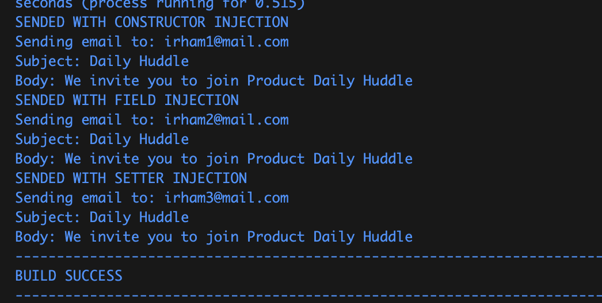

# Assignment 2
## Task 1: Working with Annotations

### [Email Service Interface](lab/src/main/java/fpt/lab/service/EmailService.java)
```java
package fpt.lab.service;

public interface EmailService {
    void sendEmail(String to, String subject, String body);
}
```
This interface defines a contract for sending emails with a method sendEmail that takes parameters `to`, `subject`, and `body`.


### [EmailServiceImpl Class](lab/src/main/java/fpt/lab/service/EmailServiceImpl.java)
```java
@Service
public class EmailServiceImpl implements EmailService {
    @Override
    public void sendEmail(String to, String subject, String body) {
        System.out.println("Sending email to: " + to);
        System.out.println("Subject: " + subject);
        System.out.println("Body: " + body);
    }
}
```
This class implements `EmailService` and provides the actual logic for sending emails. The `@Service` annotation indicates that this class is a Spring service bean.

### [Constructor Method](lab/src/main/java/fpt/lab/service/ConsEmployeeService.java)
```java
@Service
public class ConsEmployeeService {
    
    private final EmailService emailService;

    public ConsEmployeeService(EmailService emailService) {
        this.emailService = emailService;
    }

    public void notifyEmployee(String employeeEmail) {
        System.out.println("SENDED WITH CONSTRUCTOR INJECTION");
        emailService.sendEmail(
            employeeEmail,
            "Daily Huddle", 
            "We invite you to join Product Daily Huddle");
    }
}
```
This class demonstrates constructor-based dependency injection. The `EmailService` dependency is injected via the constructor.

### [Field Method](lab/src/main/java/fpt/lab/service/FieldEmployeeService.java)
```java
@Service
public class FieldEmployeeService {
    
    @Autowired
    private EmailService emailService;

    public void notifyEmployee(String employeeEmail) {
        System.out.println("SENDED WITH FIELD INJECTION");
        emailService.sendEmail(
            employeeEmail,
            "Daily Huddle", 
            "We invite you to join Product Daily Huddle");
    }
}
```
This class demonstrates field-based dependency injection. The `EmailService` dependency is injected directly into the field using the `@Autowired` annotation.

### [Setter Method](lab/src/main/java/fpt/lab/service/SetterEmployeeService.java)
```java
@Service
public class SetterEmployeeService {
    
    private EmailService emailService;

    @Autowired
    public void setEmailService(EmailService emailService) {
        this.emailService = emailService;
    }

    public void notifyEmployee(String employeeEmail) {
        System.out.println("SENDED WITH SETTER INJECTION");
        emailService.sendEmail(
            employeeEmail,
            "Daily Huddle", 
            "We invite you to join Product Daily Huddle");
    }
}
```
This class demonstrates setter-based dependency injection. The `EmailService` dependency is injected via a setter method using the `@Autowired` annotation.

### [AppConfig Class](lab/src/main/java/fpt/lab/config/AppConfig.java)
```java
@Configuration
@ComponentScan(basePackages="fpt.lab")
public class AppConfig {
}
```
This class is a Spring configuration class annotated with `@Configuration`. The `@ComponentScan` annotation tells Spring to scan the specified base package (`fpt.lab`) for components, services, and other Spring-managed beans.

### [Main Class](lab/src/main/java/fpt/lab/LabApplication.java)
```java
@SpringBootApplication
public class LabApplication {

    public static void main(String[] args) {
        SpringApplication.run(LabApplication.class, args);

        ApplicationContext context = new AnnotationConfigApplicationContext(AppConfig.class);

        // Testing Constructor Injection
        ConsEmployeeService consEmployeeService = context.getBean(ConsEmployeeService.class);
        consEmployeeService.notifyEmployee("irham1@mail.com");

        // Testing Field Injection
        FieldEmployeeService fieldEmployeeService = context.getBean(FieldEmployeeService.class);
        fieldEmployeeService.notifyEmployee("irham2@mail.com");

        // Testing Setter Injection
        SetterEmployeeService setterEmployeeService = context.getBean(SetterEmployeeService.class);
        setterEmployeeService.notifyEmployee("irham3@mail.com");
    }
}
```

This is the main class for the Spring Boot application. `ApplicationContext` is configured to use `AppConfig` for bean definitions. The main method tests three types of dependency injections by retrieving and using `ConsEmployeeService`, `FieldEmployeeService`, and `SetterEmployeeService` beans from the application context.

### Output


## Task 2: Which Injection is Better?
| Injection Type     | Description | Pros | Cons |
|--------------------|-------------|------|------|
| **Constructor Injection** | Dependencies are provided through a class constructor. | - Ensures all dependencies are provided.<br>- Makes the class immutable.<br>- Easier to write unit tests.<br>- Preferred for mandatory dependencies. | - Can lead to large constructors if there are many dependencies.<br>- All dependencies must be known at the time of object creation. |
| **Field Injection** | Dependencies are injected directly into class fields. | - Less boilerplate code.<br>- Can be useful for optional dependencies.<br>- Easy to implement for legacy code. | - Breaks encapsulation.<br>- Makes it difficult to see class dependencies at a glance.<br>- Harder to write unit tests.<br>- Cannot make the field `final`. |
| **Setter Injection** | Dependencies are provided through setter methods. | - Allows for optional dependencies.<br>- Can change dependencies at runtime.<br>- Useful for properties that can be changed after object creation. | - Possible to create an object in an invalid state if not all dependencies are set.<br>- More verbose with boilerplate code.<br>- Not as clean as constructor injection for mandatory dependencies. |

### Which One is Better?

- **Constructor Injection**: Generally considered the best practice for required dependencies because it ensures that the object is always in a valid state and all dependencies are provided. It also promotes immutability and makes the code easier to test.

- **Field Injection**: Often seen as a less desirable option due to breaking encapsulation and making dependencies less visible. It's harder to test and doesn't support immutability. However, it can be useful for legacy code or in cases where minimal boilerplate is preferred.

- **Setter Injection**: Useful for optional dependencies and allows for changing dependencies at runtime. However, it can result in more verbose code and potential issues with object state if dependencies are not set properly. It's not recommended for mandatory dependencies.

In summary, **Constructor Injection** is usually preferred due to its advantages in ensuring object validity, promoting immutability, and ease of testing. **Setter Injection** is a good choice for optional dependencies, and **Field Injection** can be useful in certain legacy scenarios but is generally less favored.

## [Optional] Task 3: Research on Circular Dependency Injection

## Introduction

**Circular dependency injection** occurs when two or more beans in a dependency injection framework (such as Spring) depend on each other, creating a circular reference. This situation can lead to runtime exceptions and make the application context fail to initialize.

## Circular Dependency Scenario

Consider two classes, `A` and `B`, where:
- Class `A` depends on Class `B`
- Class `B` depends on Class `A`

This creates a circular dependency that the Spring container struggles to resolve, leading to an exception.

```java
public class A {
    private B b;

    @Autowired
    public A(B b) {
        this.b = b;
    }
}

public class B {
    private A a;

    @Autowired
    public B(A a) {
        this.a = a;
    }
}
```

## Causes of Circular Dependency
1. **Field Injection**: When fields in two classes are annotated with `@Autowired`, leading to a cyclic reference.
2. **Setter Injection**: Similar to field injection but using setters.
3. **Constructor Injection**: This type of injection can also cause circular dependencies, though it is less common and more severe since constructors are called immediately.

## Solutions to Circular Dependency
### 1. Refactor the Code
**Break the Dependency**: Redesign the code to remove the circular dependency by introducing a third class that mediates between the two dependent classes.
### 2. Use @Lazy Annotation
The `@Lazy` annotation in Spring defers the initialization of the bean until it is needed, thus breaking the cycle.
```java
public class A {
    private B b;

    @Autowired
    public A(@Lazy B b) {
        this.b = b;
    }
}
```

### 3. Setter/Field Injection Instead of Constructor Injection
Replace constructor injection with setter or field injection to allow the Spring container to create proxies and handle the dependencies.

### 4. Application Context Configuration
Use `ApplicationContextAware` to manually fetch the dependencies from the context.

```java
@Component
public class A implements ApplicationContextAware {
    private B b;

    @Override
    public void setApplicationContext(ApplicationContext applicationContext) {
        this.b = applicationContext.getBean(B.class);
    }
}
```

### 5. Use @PostConstruct Annotation
Initialize dependencies in a method annotated with `@PostConstruct` to ensure all beans are created before the dependencies are resolved.

```java
@Component
public class A {
    private B b;

    @Autowired
    private ApplicationContext applicationContext;

    @PostConstruct
    public void init() {
        this.b = applicationContext.getBean(B.class);
    }
}
```

### Conclusion
Circular dependencies can complicate the dependency injection process, leading to runtime errors and complex debugging scenarios. By refactoring code, using the `@Lazy` annotation, switching to setter/field injection, configuring the application context, or leveraging `@PostConstruct`, you can effectively manage and resolve circular dependencies in Spring applications.

## Task 4: Spring Annotations Explained
### @Configuration
- **Purpose**: Indicates that a class declares one or more `@Bean` methods and can be processed by the Spring container to generate bean definitions and service requests.
- **Example**:
    ```java
    import org.springframework.context.annotation.Bean;
    import org.springframework.context.annotation.Configuration;

    @Configuration
    public class AppConfig {

        @Bean
        public MyService myService() {
            return new MyServiceImpl();
        }
    }
    ```

### @Bean
- **Purpose**: Indicates that a method produces a bean to be managed by the Spring container.
- **Example**:
    ```java
    @Configuration
    public class AppConfig {

        @Bean
        public MyService myService() {
            return new MyServiceImpl();
        }
    }
    ```

### @ComponentScan
- **Purpose**: Configures which packages to scan for annotated components.
- **Example**:
    ```java
    import org.springframework.context.annotation.ComponentScan;
    import org.springframework.context.annotation.Configuration;

    @Configuration
    @ComponentScan(basePackages = "com.example.myapp")
    public class AppConfig {
    }
    ```

### @Component
- **Purpose**: Indicates that an annotated class is a "component" and will be automatically detected through classpath scanning.
- **Example**:
    ```java
    import org.springframework.stereotype.Component;

    @Component
    public class MyComponent {
    }
    ```

### @Service
- **Purpose**: A specialization of `@Component` for service-layer classes.
- **Example**:
    ```java
    import org.springframework.stereotype.Service;

    @Service
    public class MyService {
    }
    ```

### @Repository
- **Purpose**: A specialization of `@Component` for DAO (Data Access Object) classes.
- **Example**:
    ```java
    import org.springframework.stereotype.Repository;

    @Repository
    public class MyRepository {
    }
    ```

### @Autowired
- **Purpose**: Marks a constructor, field, setter method, or config method as to be autowired by Spring's dependency injection facilities.
- **Example**:
    ```java
    import org.springframework.beans.factory.annotation.Autowired;
    import org.springframework.stereotype.Component;

    @Component
    public class MyComponent {

        @Autowired
        private MyService myService;
    }
    ```

### @Scope
- **Purpose**: Specifies the scope of a bean (singleton, prototype, etc.).
- **Example**:
    ```java
    import org.springframework.context.annotation.Scope;
    import org.springframework.stereotype.Component;

    @Component
    @Scope("prototype")
    public class MyPrototypeBean {
    }
    ```

### @Qualifier
- **Purpose**: Indicates which bean to inject when there are multiple beans of the same type.
- **Example**:
    ```java
    import org.springframework.beans.factory.annotation.Autowired;
    import org.springframework.beans.factory.annotation.Qualifier;
    import org.springframework.stereotype.Component;

    @Component
    public class MyComponent {

        @Autowired
        @Qualifier("specificService")
        private MyService myService;
    }
    ```

### @PropertySource, @Value
- **Purpose**: `@PropertySource` is used to declare a property source for a Spring application, and `@Value` is used to inject property values into Spring-managed beans.
- **Example**:
    ```java
    import org.springframework.beans.factory.annotation.Value;
    import org.springframework.context.annotation.Configuration;
    import org.springframework.context.annotation.PropertySource;

    @Configuration
    @PropertySource("classpath:application.properties")
    public class AppConfig {

        @Value("${my.property}")
        private String myProperty;

        @Bean
        public MyBean myBean() {
            System.out.println("Property value: " + myProperty);
            return new MyBean();
        }
    }
    ```

### @PreDestroy, @PostConstruct
- **Purpose**: `@PostConstruct` is used on a method that needs to be executed after dependency injection is done to perform any initialization, and `@PreDestroy` is used on a method that needs to be executed before the bean is destroyed.
- **Example**:
    ```java
    import javax.annotation.PostConstruct;
    import javax.annotation.PreDestroy;
    import org.springframework.stereotype.Component;

    @Component
    public class MyComponent {

        @PostConstruct
        public void init() {
            System.out.println("PostConstruct method called");
        }

        @PreDestroy
        public void destroy() {
            System.out.println("PreDestroy method called");
        }
    }
    ```

### Summary

- `@Configuration`: Defines a configuration class.
- `@Bean`: Declares a bean to be managed by Spring.
- `@ComponentScan`: Configures package scanning.
- `@Component`: Marks a class as a Spring component.
- `@Service`: Marks a service-layer class.
- `@Repository`: Marks a DAO class.
- `@Autowired`: Injects dependencies.
- `@Scope`: Defines the bean scope.
- `@Qualifier`: Specifies which bean to inject.
- `@PropertySource`: Declares a property source.
- `@Value`: Injects property values.
- `@PostConstruct`: Marks a method to be run after bean creation.
- `@PreDestroy`: Marks a method to be run before bean destruction.
