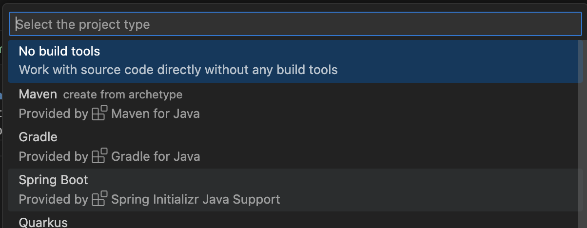
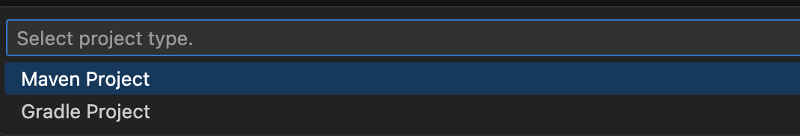
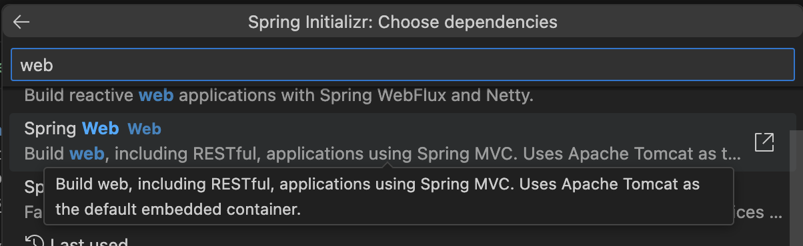
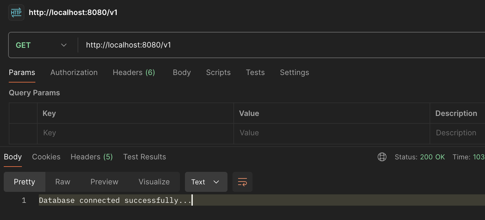

# Assignment 1 - Create Spring Boot Project
On this assignment, I explored how to create a Spring Boot Project. For the full project, you can navigate to this [repository](lab/src/main/java/fpt/lab).

First, let's create the Java Spring Boot project. This time, I used Visual Studio Code and it seems like this.


Choose Maven for the dependencies/package manager.


Choose the `Spring Web` dependecy. It's useful to create RESTful API using Spring framework.


After we create the project, the main class will be shown like [this](lab/src/main/java/fpt/lab/LabApplication.java).
```java
@SpringBootApplication
public class LabApplication {

	public static void main(String[] args) {
		SpringApplication.run(LabApplication.class, args);
	}

}
```

Now, let's create a [Sample Controller](lab/src/main/java/fpt/lab/SampleController.java).
```java
@Controller
@RequestMapping("/v1")
public class SampleController {
    @GetMapping
    @ResponseBody
    public String base() {
        return "Database connected successfully...";
    }
}
```
#### @Controller
- **Purpose**: Marks the class as a Spring MVC controller.
- **Functionality**: Indicates that this class can handle HTTP requests.
- **Usage**: Classes annotated with @Controller are used to define endpoints and map web requests to methods.

#### @RequestMapping("/v1")
- **Purpose**: Maps HTTP requests to handler methods of MVC and REST controllers.
- **Functionality**: Specifies the base URL path that this controller will handle.
- **Usage**: The SampleController will handle all requests that start with `/v1`.

#### @GetMapping
- **Purpose**: Maps HTTP GET requests onto specific handler methods.
- **Functionality**: Indicates that the `base()` method should be called when a GET request is made to `/v1`.
- **Usage**: The `base()` method will handle GET requests to the /v1 URL.

#### @ResponseBody
- **Purpose**: Indicates that the return value of the method will be the response body.
- **Functionality**: The return value will be written directly to the HTTP response (instead of being resolved to a view).
- **Usage**: The string "Database connected successfully..." will be sent as the HTTP response body when the base() method is called.

### Test it with Postman
