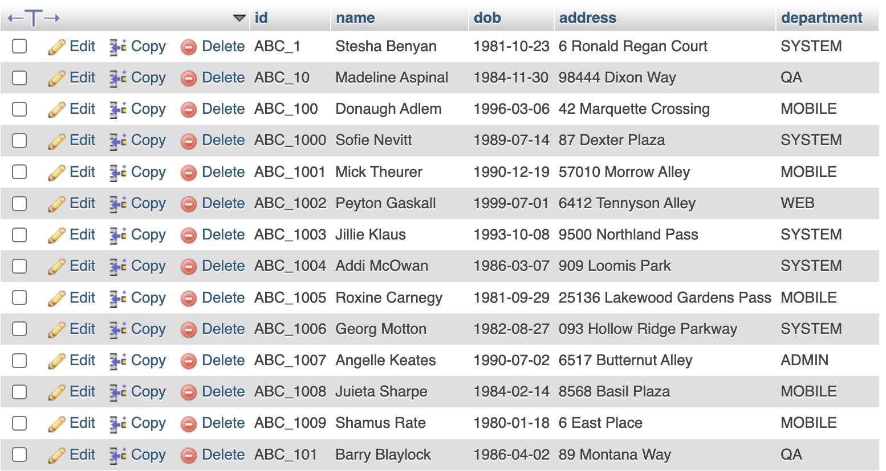
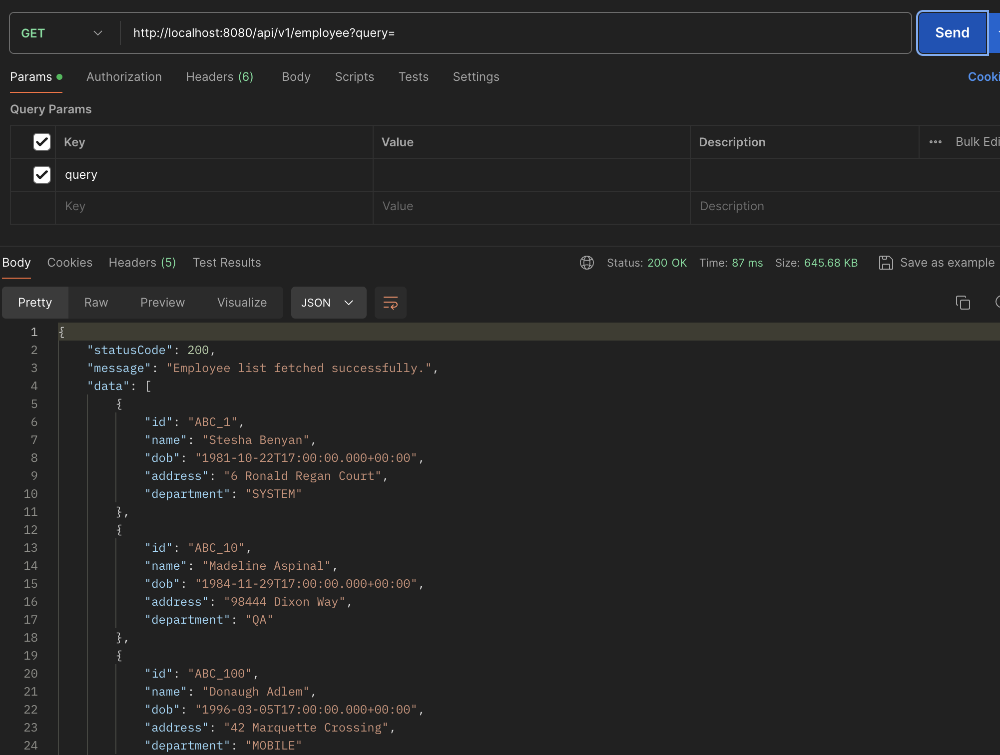
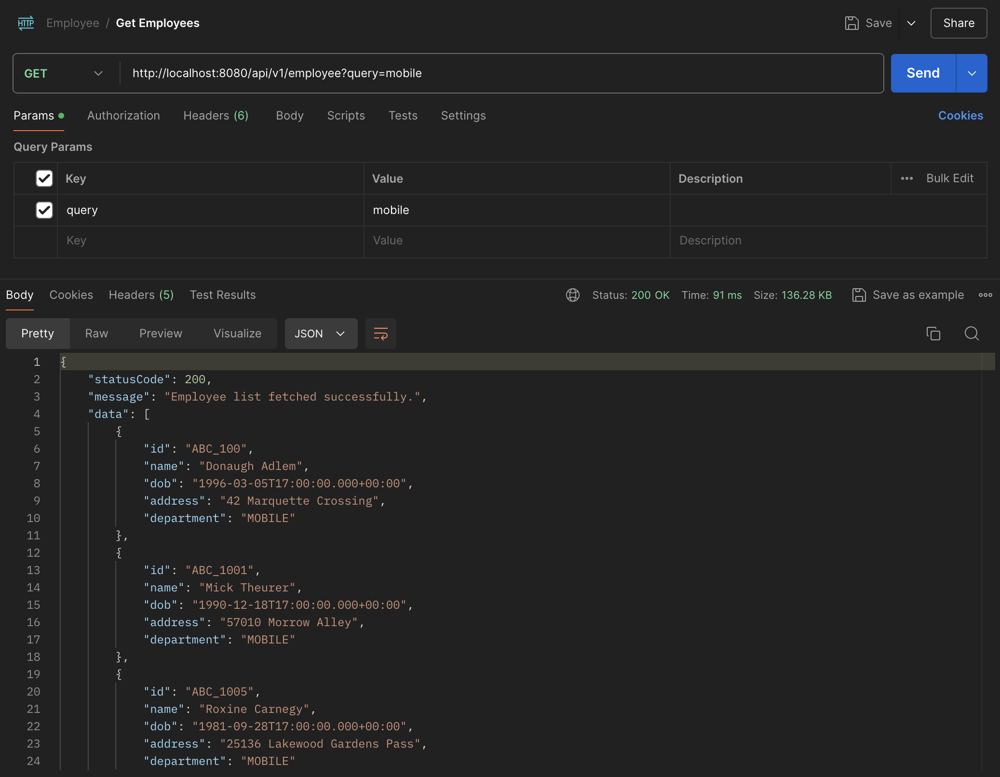
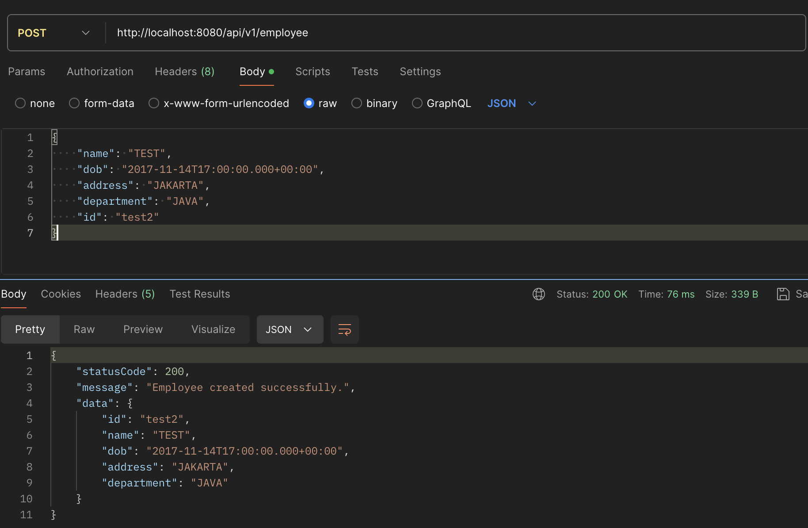
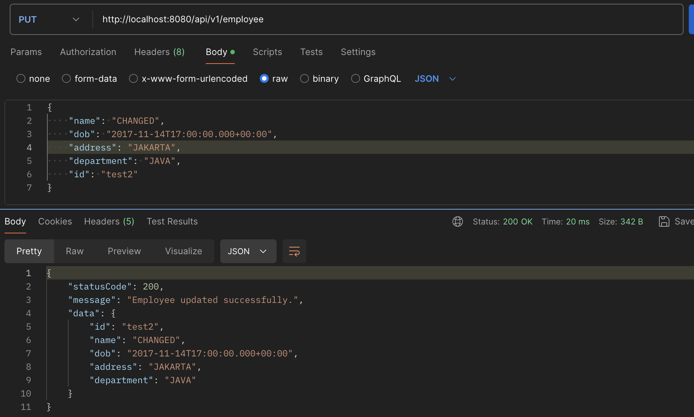
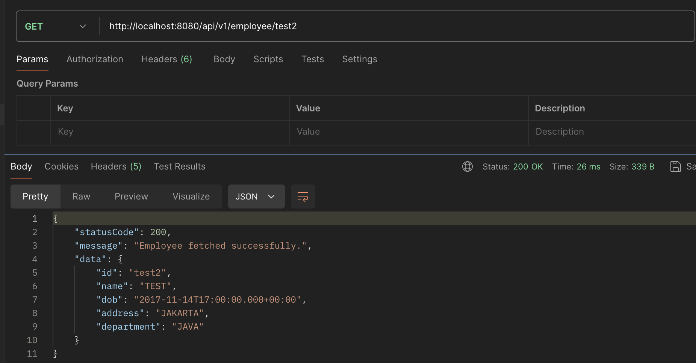
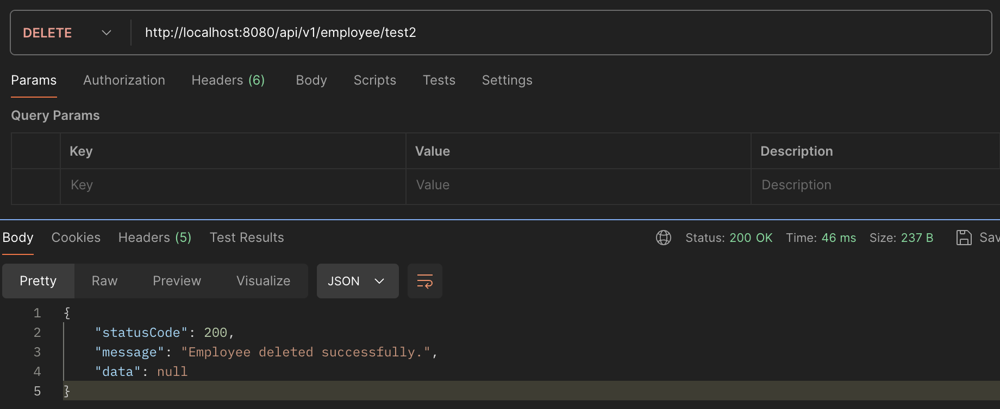

# Assignment 2 - Spring Boot Employee Project
## Create Employee table with basic information​
First, we initialize the table in the MySQL database by input this SQL code.
```sql
CREATE TABLE Employee (
    id VARCHAR(255) PRIMARY KEY,
    name VARCHAR(255),
    dob DATE,
    address VARCHAR(255),
    department VARCHAR(255)
);
```
After that, let's add sample data to the table.


## Simple CRUD using JDBC Template
### Models
#### [ApiResponse](lab/src/main/java/fpt/lab/model/ApiResponse.java)
```java
@Data
@AllArgsConstructor
@NoArgsConstructor
public class ApiResponse<T> {
    private int statusCode;
    private String message;
    private T data;
}
```
This generic class is used to handle the response of API request.

#### [Employee](lab/src/main/java/fpt/lab/model/Employee.java)
```java
@Data
@AllArgsConstructor
@NoArgsConstructor
public class Employee {
    private String id;
    private String name;
    private Date dob;
    private String address;
    private String department;
}
```
This class is a blueprint/model for the `Employee` data.

### [Repository](lab/src/main/java/fpt/lab/repository/EmployeeRepository.java)
First, let's create a Repository called `EmployeeRepository`
```java
@Repository
public class EmployeeRepository {
    
    @Autowired
    private JdbcTemplate jdbcTemplate;
}
```
- `@Repository` annotation declares that this class is a Spring Repository.
- Add `jdbcTemplate` attribut with `@AutoWired` annotation to make sure that `JdbcTemplate` will be injected automatically.

Next, let's add basic CRUD methods.
```java
    public int save(Employee employee) {
        final String sql = "INSERT INTO Employee (id, name, dob, address, department) VALUES (?, ?, ?, ?, ?)";
        return jdbcTemplate.update(
            sql,
            employee.getId(), 
            employee.getName(), 
            employee.getDob(), 
            employee.getAddress(), 
            employee.getDepartment()
        );
    }
```
This method is used to create and insert a new Employee data into the table.

<br>

```java
    public int update(Employee employee) {
        final String sql = "UPDATE Employee SET name = ?, dob = ?, address = ?, department = ? WHERE id = ?";
        return jdbcTemplate.update(
            sql,
            employee.getName(), 
            employee.getDob(), 
            employee.getAddress(), 
            employee.getDepartment(), 
            employee.getId()
        );
    }
```
This methd is used to update an Employee data in the table.

<br>

```java
    public Employee findById(String id) {
        final String sql = "SELECT * FROM Employee WHERE id = ?";
        return jdbcTemplate.queryForObject(
            sql,
            new BeanPropertyRowMapper<>(Employee.class), 
            id
        );
    }
```
This methd is used to get an Employee data in the table that match with the requested id.

<br>

```java
    public int deleteById(String id) {
        final String sql = "DELETE FROM Employee WHERE id = ?";
        return jdbcTemplate.update(sql, id);
    }
```
This methd is used to delete an Employee data in the table that match with the requested id.

<br>

```java
    public List<Employee> findAll() {
        return jdbcTemplate.query(
            "SELECT * FROM Employee", 
            new BeanPropertyRowMapper<>(Employee.class)
        );
    }

    public List<Employee> search(String query) {
        String sql = "SELECT * FROM Employee WHERE name LIKE ? OR address LIKE ? OR department LIKE ?";
        String likeQuery = "%" + query + "%";
        return jdbcTemplate.query(
            sql, 
            new BeanPropertyRowMapper<>(Employee.class), 
            likeQuery, 
            likeQuery, 
            likeQuery
        );
    }
```
Basically, these two methods are used to get Employees data. The different is, the `search` method can receive a `query`. Whenever the query is match with the data of employees name/address/department, the data will be shown.

### [Service](lab/src/main/java/fpt/lab/service/EmployeeService.java)
```java
@Service
public class EmployeeService {
    
    @Autowired
    private EmployeeRepository repository;

    public int save(Employee employee) {
        return repository.save(employee);
    }

    public int update(Employee employee) {
        return repository.update(employee);
    }

    public Employee findById(String id) {
        return repository.findById(id);
    }

    public int deleteById(String id) {
        return repository.deleteById(id);
    }

    public List<Employee> findAll() {
        return repository.findAll();
    }

    public List<Employee> search(String query) {
        return repository.search(query);
    }
}
```
- The `EmployeeService` class acts as an intermediary between the controller layer and the repository layer.
- `@Service` annotation indicates that this class is a Spring service. It is a specialization of the `@Component` annotation and is used to mark the class as a service provider. The Spring framework will manage this class as a bean.
- `@Autowired` is used to automatically inject the `EmployeeRepository` bean into this service.

### [Controller](lab/src/main/java/fpt/lab/controller/EmployeeController.java)
```java
@RestController
@RequestMapping("api/v1/employee")
public class EmployeeController {
    
    @Autowired
    private EmployeeService service;

    @GetMapping
    public ApiResponse<List<Employee>> getEmployees(@RequestParam(required = false) String query) {
        List<Employee> employees;
        if (query != null) {
            employees = service.search(query);
        } else {
            employees = service.findAll();
        }
        return new ApiResponse<>(HttpStatus.OK.value(), "Employee list fetched successfully.", employees);
    }

    @PostMapping
    public ApiResponse<Employee> addEmployee(@RequestBody Employee employee) {
        service.save(employee);
        return new ApiResponse<>(HttpStatus.OK.value(), "Employee created successfully.", employee);
    }

    @PutMapping
    public ApiResponse<Employee> updateEmployee(@RequestBody Employee employee) {
        service.update(employee);
        return new ApiResponse<>(HttpStatus.OK.value(), "Employee updated successfully.", employee);
    }

    @DeleteMapping("/{id}")
    public ApiResponse<Void> deleteEmployeeById(@PathVariable String id) {
        service.deleteById(id);
        return new ApiResponse<>(HttpStatus.OK.value(), "Employee deleted successfully.", null);
    }

    @GetMapping("/{id}")
    public ApiResponse<Employee> getEmployeeById(@PathVariable String id) {
        Employee employee = service.findById(id);
        return new ApiResponse<>(HttpStatus.OK.value(), "Employee fetched successfully.", employee);
    }
}
```
- `@RestController`: Marks the class as a controller with RESTful endpoints.
- `@RequestMapping`: Maps the class to a specific URL prefix.
- `@Autowired`: Injects the `EmployeeService` into the controller.
- `@GetMapping`: Handles GET requests, optionally with a `query` parameter.
- `@PostMapping`: Handles POST requests to create a new employee.
- `@PutMapping`: Handles PUT requests to update an existing employee.
- `@DeleteMapping`: Handles DELETE requests to delete an employee by ID.
- `@PathVariable`: Binds a method parameter to a path variable in the URL.
- `@RequestBody`: Binds the HTTP request body to a method parameter.

## Let's test it!
Let's run the project and test the APIs from Postman.
### Get Employees

As we can see, the response contains `statusCode` of 200, which indicates that the request is succeed. And the `data` provides a bunch of employee data.

On this same API, we can test it using query to search list of employees that match to our keyword. For example, I input the query with `mobile`, and it shown all the employees in the MOBILE department.


### Create Employee
To create an employee, we should provide the body that contains: `name`, `dob`, `address`, `department`, and `id`. We can set the HTTP method into POST.


### Update Employee
To update the employee, it's similar to create. We can set the HTTP method into PUT.


### Get Employee by ID
This method is to get an employee that match with ID. We can try it by request the API with GET method and using url: `http://localhost:8080/api/v1/employee/{ID}`


### Delete Employee
This method is to delete an employee using DELETE HTTP method.
