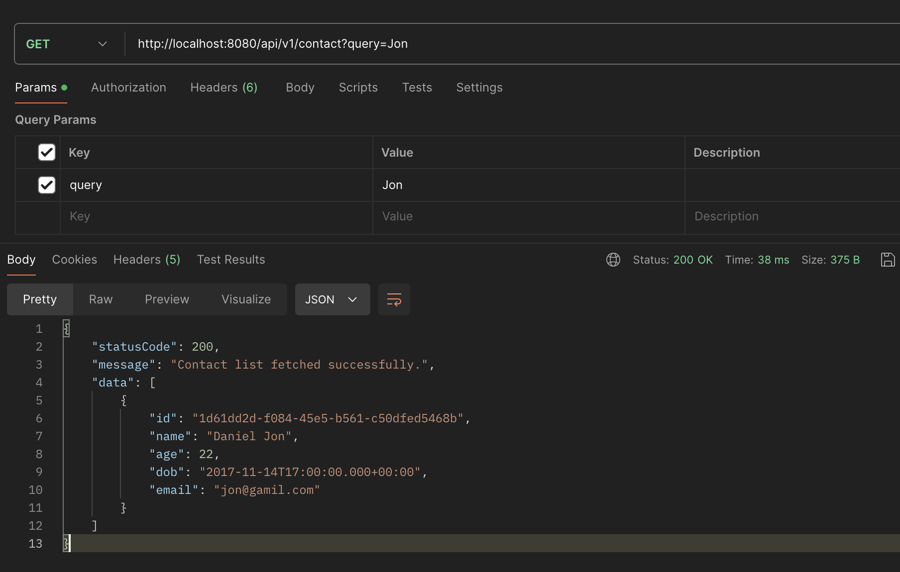

# Assignment 3
## Task 1: Create Multiple Datasoure using Bean, not application properties

### Disable/Comment Code on the Properties
First, let's comment the [properties](/Week%204/Unit%2008/Assignment%202/lab/src/main/resources/application.properties) code to make sure that we don't use that.
```properties
spring.application.name=lab
spring.main.allow-bean-definition-overriding=true
# spring.datasource.driver-class-name=com.mysql.cj.jdbc.Driver
# spring.datasource.url=jdbc:mysql://localhost:3306/employee
# spring.datasource.username=root
```

### Create Data Source Config
Let's create some data source config files to demonstrate how to use multiple data source. The first one is [EmployeeDataSourceConfig.java](/Week%204/Unit%2008/Assignment%202/lab/src/main/java/fpt/lab/config/EmployeeDataSourceConfig.java).
```java
@Configuration
public class EmployeeDataSourceConfig {
    
    @Bean(name="employeeDataSource")
    public DataSource employeeDataSource() {
        DriverManagerDataSource driver = new DriverManagerDataSource();
        driver.setDriverClassName("com.mysql.cj.jdbc.Driver");
        driver.setUrl("jdbc:mysql://localhost:3306/employee");
        driver.setUsername("root");
        driver.setPassword("");
        return driver;
    }

    @Bean(name="employeeJdbcTemplate")
    public JdbcTemplate jdbcTemplate(@Qualifier("employeeDataSource") DataSource dataSource) {
        return new JdbcTemplate(dataSource);
    }
}
```
- Specify the bean name explicitly to prevent the missmatch with other beanas.
- Create `DriverManagerDataSource` instance and set the driver class name, url, username, and the password.
- `@Qualifier` annotation used to make sure that the beans that we used is with our specified name.

Let's make another data source config! In this case, we're gonna make [ContactDataSourceConfig](/Week%204/Unit%2008/Assignment%202/lab/src/main/java/fpt/lab/config/ContactDataSourceConfig.java). It's similar with `EmployeeDataSourceConfig`, the only differences are the Bean name and the source of the data.
```java
@Configuration
public class ContactDataSourceConfig {
    
    @Bean(name="contactDataSource")
    public DataSource contactDataSource() {
        DriverManagerDataSource driver = new DriverManagerDataSource();
        driver.setDriverClassName("com.mysql.cj.jdbc.Driver");
        driver.setUrl("jdbc:mysql://localhost:3306/unit5");
        driver.setUsername("root");
        driver.setPassword("");
        return driver;
    }

    @Bean(name="contactJdbcTemplate")
    public JdbcTemplate jdbcTemplate(@Qualifier("contactDataSource") DataSource dataSource) {
        return new JdbcTemplate(dataSource);
    }
}
```

### Modify the Repository
On our repository, let's add `@Qualifier` annotation to make sure that it's wired to our specified bean name. Example for [EmployeeRepository](/Week%204/Unit%2008/Assignment%202/lab/src/main/java/fpt/lab/repository/EmployeeRepository.java).
```java
@Repository
public class EmployeeRepository {
    
    @Autowired
    @Qualifier("employeeJdbcTemplate")
    private JdbcTemplate jdbcTemplate;

    // Rest of Code ....
```
Don't forget to do the same thing to other repository.

Open this to create some code for `Contact`:
- [Model](/Week%204/Unit%2008/Assignment%202/lab/src/main/java/fpt/lab/model/Contact.java)
- [Repository](/Week%204/Unit%2008/Assignment%202/lab/src/main/java/fpt/lab/repository/ContactRepository.java)
- [Service](/Week%204/Unit%2008/Assignment%202/lab/src/main/java/fpt/lab/service/ContactService.java)
- [Controller](/Week%204/Unit%2008/Assignment%202/lab/src/main/java/fpt/lab/controller/ContactController.java)


### Let's Try It!
Let's run the project and test it with Postman. In this case, I tried to request the `Get Contact` API and here's the result



### Conclusion
We can use multiple data source by adding the configuration and specify our source of data. Don't forget to specify bean name to prevent mismatching to the bean.

## Task 2: Handle transaction when insert/update data​
### What is a Transaction?
A transaction is a sequence of operations performed as a single logical unit of work. A transaction ensures that all operations within it either complete successfully or have no effect at all. This all-or-nothing property is known as atomicity.

### ACID Properties
Transactions have four key properties, collectively known as ACID properties:

- **Atomicity**: Ensures that all operations within a transaction are completed successfully. If any operation fails, the transaction is aborted, and all operations are rolled back to maintain data integrity.
- **Consistency**: Ensures that a transaction transforms the database from one valid state to another valid state. It maintains the integrity constraints of the database.
- **Isolation**: Ensures that the operations of one transaction are isolated from those of other transactions. This prevents transactions from interfering with each other and ensures consistency.
- **Durability**: Ensures that once a transaction is committed, its effects are permanently recorded in the database, even in the case of a system failure.

### Transaction Lifecycle
A typical transaction lifecycle involves the following steps:

- **Begin**: The transaction starts, and operations are performed.
- **Commit**: If all operations are successful, the transaction is committed, making all changes permanent.
- **Rollback**: If any operation fails, the transaction is rolled back, undoing all changes made during the transaction.

### Implementation on Our Code
To implement transaction on our project, we need to add `TransactionConfig`, modify our `DataSourceConfig` and `Services`.

#### Create [Transaction Config](/Week%204/Unit%2008/Assignment%202/lab/src/main/java/fpt/lab/config/TransactionConfig.java)
```java
@Configuration
@EnableTransactionManagement
public class TransactionConfig {
    
    @Bean
    public PlatformTransactionManager employeeTransactionManager(DataSource employeeDataSource) {
        return new DataSourceTransactionManager(employeeDataSource);
    }

    @Bean
    public PlatformTransactionManager contactTransactionManager(DataSource contactDataSource) {
        return new DataSourceTransactionManager(contactDataSource);
    }

    @Bean
    public TransactionTemplate employeeTransactionTemplate(PlatformTransactionManager employeeTransactionManager) {
        return new TransactionTemplate(employeeTransactionManager);
    }

    @Bean
    public TransactionTemplate contactTransactionTemplate(PlatformTransactionManager contactTransactionManager) {
        return new TransactionTemplate(contactTransactionManager);
    }
}
```
- `@EnableTransactionManagement`: This annotation enables Spring's annotation-driven transaction management capability. It allows the use of the `@Transactional` annotation in service methods to manage transactions declaratively.
- `DataSourceTransactionManager` is a Spring-provided implementation of `PlatformTransactionManager` that manages transactions for a JDBC `DataSource`.

#### Modify Our Data Source Config
**[EmployeeDataSourceConfig](/Week%204/Unit%2008/Assignment%202/lab/src/main/java/fpt/lab/config/EmployeeDataSourceConfig.java)**
```java
@Configuration
public class EmployeeDataSourceConfig {
    
    @Bean(name="employeeDataSource")
    public DataSource employeeDataSource() {
        HikariConfig config = new HikariConfig();
        config.setDriverClassName("com.mysql.cj.jdbc.Driver");
        config.setJdbcUrl("jdbc:mysql://localhost:3306/employee");
        config.setUsername("root");
        config.setPassword("");
        return new HikariDataSource(config);
    }
    // Rest of code...
```
- This code configures a `HikariConfig` object with the necessary database connection properties (JDBC driver, URL, username, and password) and returns a `HikariDataSource` instance.

#### Modify Our Services
**[EmployeeService](/Week%204/Unit%2008/Assignment%202/lab/src/main/java/fpt/lab/service/EmployeeService.java)**
```java
@Service
public class EmployeeService {
    
    @Autowired
    private EmployeeRepository repository;

    @Transactional(transactionManager = "employeeTransactionManager")
    public int save(Employee employee) {
        return repository.save(employee);
    }

    @Transactional(transactionManager = "employeeTransactionManager")
    public int update(Employee employee) {
        return repository.update(employee);
    }

    // Rest of code...
```
- `@Transactional`: This annotation is used to indicate that the method should be executed within a transactional context. It tells Spring to manage the transaction boundaries for the annotated method.
- `transactionManager = "employeeTransactionManager"`: This attribute specifies which transaction manager to use for this transaction. In this case, it refers to a bean named `employeeTransactionManager`. This is important when your application uses multiple data sources and each data source has its own transaction manager.

#### How It Works
1. Transaction Management Enablement: By adding `@EnableTransactionManagement`, Spring is instructed to look for `@Transactional` annotations on beans and manage transactions accordingly.
2. When the save method is called, Spring checks for the `@Transactional` annotation.
3. Since the `transactionManager` attribute is set to `employeeTransactionManager`, Spring uses the specified transaction manager to manage the transaction for this method.
4. If the method completes successfully, Spring commits the transaction.
5. If an exception is thrown, Spring rolls back the transaction to ensure that no partial changes are persisted to the database.

## Task 3: Research Lombok and add to project​
**Lombok** is a Java library that helps reduce boilerplate code in POJOs (Plain Old Java Objects). It provides annotations to automatically generate getters, setters, constructors, and other common methods.

#### Example: [Employee Class](/Week%204/Unit%2008/Assignment%202/lab/src/main/java/fpt/lab/model/Employee.java) with Lombok

```java
import lombok.Data;
import lombok.AllArgsConstructor;
import lombok.NoArgsConstructor;
import java.util.Date;

@Data  // Generates getters, setters, toString, equals, and hashCode methods
@AllArgsConstructor  // Generates constructor with all arguments
@NoArgsConstructor  // Generates default constructor
public class Employee {
    private String id;
    private String name;
    private Date dob;
    private String address;
    private String department;
}
```

- `@Data`: This annotation combines `@Getter`, `@Setter`, `@ToString`, `@EqualsAndHashCode`, and `@RequiredArgsConstructor`. It generates getters for all fields, setters for all non-final fields, toString, equals, and hashCode methods.
- `@AllArgsConstructor`: Generates a constructor with all arguments. This constructor initializes all fields of the class.
- `@NoArgsConstructor`: Generates a no-argument constructor. This constructor initializes the object with default values.