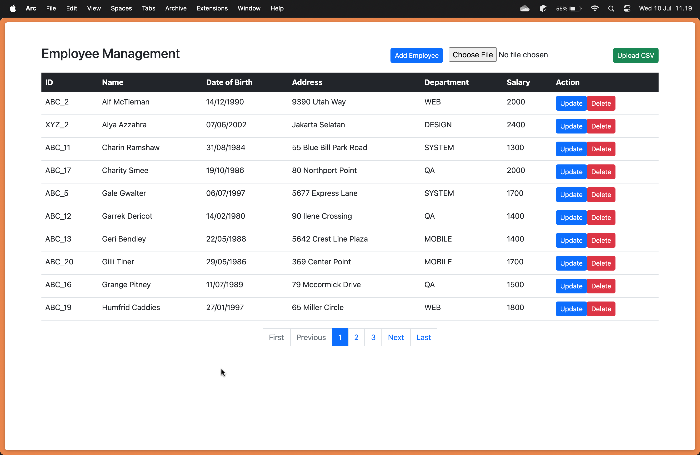
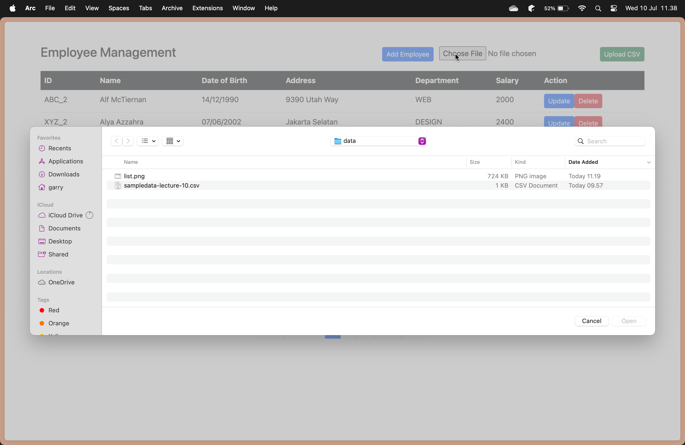

# Assignment 2 - MVC Employee Management

On this assignment, I explored how to implement MVC using java spring boot. You can navigate to full source code [here](lab/src/main). This is an Employee Management Website with main feature: show employee list, update, delete, and create employee, also you can import employee data from CSV file.

## Employee List


You can navigate to View File [here](lab/src/main/resources/templates/employees/list-employees.html), which managed by html file.

### Data Logic
#### [EmployeeService](lab/src/main/java/findo/lab/repository/EmployeeRepository.java)
```java
public interface EmployeeService {
    // ...

    List<Employee> findPaginated(int page, int size);
    long countEmployees();
}

@Service
@AllArgsConstructor
public class EmployeeServiceImpl implements EmployeeService {
    // ...

    @Override
    public List<Employee> findPaginated(int page, int size) {
        return employeeRepository.findAll(PageRequest.of(page, size, Sort.by("name").ascending())).getContent();
    }

    @Override
    public long countEmployees() {
        return employeeRepository.count();
    }
}
```

1. `findPaginated(int page, int size)`:
    - **Explanation**: This method retrieves a paginated list of employees sorted by their names.
    - **Parameters**:
    - `page`: The page number (0-indexed) of the results to retrieve.
    - `size`: The number of items per page.
    - **Implementation**: This method uses` PageRequest.of(page, size, Sort.by("name").ascending())` to create a pagination request to the repository. PageRequest defines the page and page size, while `Sort.by("name").ascending()` sorts the results by name in ascending order.

2. `countEmployees()`:
    - **Explanation**: This method counts the total number of employees.
    - **Return Value**: The total count of employees stored in the database.
    - **Implementation**: This method uses `employeeRepository.count()` to count the total number of employees. count() is a built-in method provided by `JpaRepository` that returns the total count of entities in the specified table.

#### [EmployeeController](lab/src/main/java/findo/lab/controller/EmployeeController.java)
```java
@AllArgsConstructor
@Controller
@RequestMapping("/employees")
public class EmployeeController {

    private final EmployeeService employeeService;

    @GetMapping("/list")
    public String listEmployees(Model theModel, @RequestParam(defaultValue = "0") int page) {
        int pageSize = 10;
        List<Employee> theEmployees = employeeService.findPaginated(page, pageSize);
        long totalEmployees = employeeService.countEmployees();

        theModel.addAttribute("employees", theEmployees);
        theModel.addAttribute("currentPage", page);
        theModel.addAttribute("totalEmployees", totalEmployees);
        theModel.addAttribute("totalPages", (int) Math.ceil((double) totalEmployees / pageSize));

        return "employees/list-employees";
    }
    // ...
}
```
`listEmployees(Model theModel, @RequestParam(defaultValue = "0") int page)`:
- **Purpose**: Handles GET requests to `"/employees/list"` to fetch a paginated list of employees.
- **Parameters**:
    - `theModel`: Spring MVC model to which attributes are added for rendering in the view.
    - `page`: Optional query parameter specifying the current page number (default is 0 if not provided).
- **Method Implementation**:
    - Retrieves a paginated list of employees using `employeeService.findPaginated(page, pageSize)`, where `pageSize` is set to 10.
    - Counts the total number of employees with `employeeService.countEmployees()`.
    - Calculates the total number of pages (`totalPages`) using `Math.ceil((double) totalEmployees / pageSize)`.
- **Adds attributes to the model**:
    - `"employees"`: List of employees for the current page.
    - `"currentPage"`: Current page number being viewed.
    - `"totalEmployees"`: Total count of all employees.
    - `"totalPages"`: Total number of pages needed to display all employees paginated.
- **Return Value**: Returns the view name `"employees/list-employees"` to render the paginated employee list.

## Upload CSV

To upload, we can choose file from our device directory and click on `Upload CSV` button.

### Data Logic
#### [FileUtlis](lab/src/main/java/findo/lab/utils/FileUtils.java)
```java
public class FileUtils {

    public static String cleanCsvField(String field) {
        if (field == null) {
            return null;
        }
        return field.trim().replace("\b", "");
    }

    public static String getCleanCsvValue(CSVRecord csvRecord, String header) {
        return cleanCsvField(csvRecord.get(header));
    }

    public static List<Employee> getEmployeeFromCSV(MultipartFile file) {
        List<Employee> employees = new ArrayList<>();
        try (Reader reader = new BufferedReader(new InputStreamReader(file.getInputStream(), StandardCharsets.UTF_8))) {
            CSVFormat csvFormat = CSVFormat.Builder.create()
                .setHeader("ID", "Name", "DateOfBirth", "Address", "Department", "Salary")
                .setSkipHeaderRecord(true)
                .build();

            try (CSVParser csvParser = new CSVParser(reader, csvFormat)) {
                for (CSVRecord csvRecord : csvParser) {
                    Employee employee = new Employee();
                    
                    employee.setId(getCleanCsvValue(csvRecord, "ID"));
                    employee.setName(getCleanCsvValue(csvRecord, "Name"));
                    employee.setDob(new SimpleDateFormat("dd/MM/yyyy").parse(getCleanCsvValue(csvRecord, "DateOfBirth")));
                    employee.setAddress(getCleanCsvValue(csvRecord, "Address"));
                    employee.setDepartment(getCleanCsvValue(csvRecord, "Department"));
                    employee.setSalary(Integer.parseInt(getCleanCsvValue(csvRecord, "Salary")));
                    
                    employees.add(employee);
                }
            }
        } catch (Exception e) {
            System.out.println("Error parsing CSV File: " + e.getLocalizedMessage());
        }
        return employees;
    }
}
```

This class used to handle the CSV File input. When we input the CSV file from `MultipartFile`, we first clean the data. After that, we create the Employee List and add the value from every row of the CSV.

#### [EmployeeService](lab/src/main/java/findo/lab/repository/EmployeeRepository.java)
```java
@Service
@AllArgsConstructor
public class EmployeeServiceImpl implements EmployeeService {
    // ...
    @Override
    public void uploadCSVFile(MultipartFile file) {
        try {
            List<Employee> employees = FileUtils.getEmployeeFromCSV(file);
            employeeRepository.saveAll(employees);
        } catch (Exception e) {
            throw new RuntimeException("Error when uploading CSV File: " + e.getMessage());
        }
    }
}
```
This method used to get all of the employee from the CSV. Then, it save all of the data into the database by calling the `employeeRepository.saveAll()` method.

#### [EmployeeController](lab/src/main/java/findo/lab/controller/EmployeeController.java)
```java
@AllArgsConstructor
@Controller
@RequestMapping("/employees")
public class EmployeeController {
    // ...
    @PostMapping("/upload")
    public String uploadCSVFile(@RequestParam("file") MultipartFile file) {
        employeeService.uploadCSVFile(file);
        return "redirect:/employees/list";
    }
}
```

On this method, we call the method from the Service, and control the View to redirect to `employees/list`.