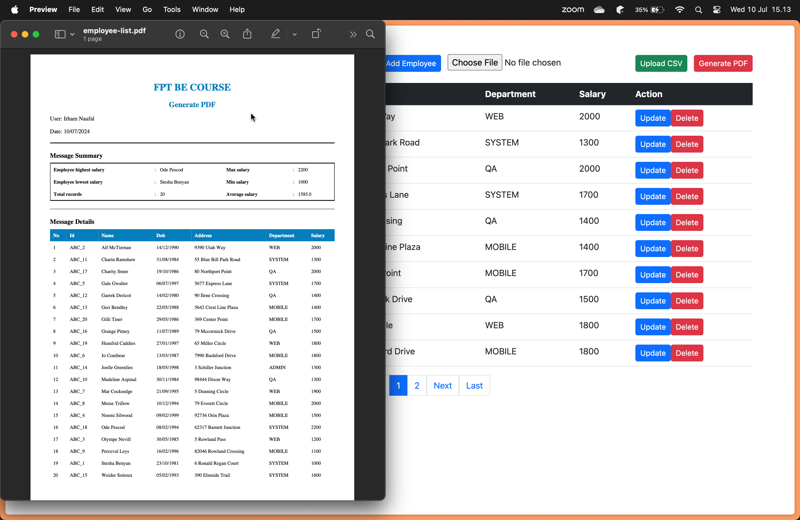

# Assignment 3: Generate PDF
In this assignment, I explored how to generate PDF from HTML. Here's the sample output for the [PDF](data/export.png) data. To implement it, there are several steps that we have to do.



## Add Dependecies
This time, I used `openhtmltopdf` library to export the HTML into a PDF file. You can add the dependencies on the [pom.xml file](lab/pom.xml)
```xml
<dependency>
	<groupId>com.openhtmltopdf</groupId>
	<artifactId>openhtmltopdf-pdfbox</artifactId>
	<version>1.0.10</version>
</dependency>
<dependency>
	<groupId>com.openhtmltopdf</groupId>
	<artifactId>openhtmltopdf-slf4j</artifactId>
	<version>1.0.10</version>
</dependency>
```

## Create PDF Generator Service
I created [PDFGeneratorService](lab/src/main/java/findo/lab/service/impl/PdfGeneratorServiceImpl.java) to handle logic for generating the PDF.
```java
@Service
@AllArgsConstructor
public class PdfGeneratorServiceImpl implements PdfGeneratorService {

    private final TemplateEngine templateEngine;

    @Override
    public ByteArrayInputStream generatePdf(String templateName, Map<String, Object> data) {
        // Step 1: Prepare the Thymeleaf context with data
        Context context = new Context();
        context.setVariables(data);

        // Step 2: Process the HTML template using Thymeleaf
        String html = templateEngine.process("pdf/" + templateName, context);

        // Step 3: Generate PDF from the rendered HTML content
        ByteArrayOutputStream outputStream = new ByteArrayOutputStream();
        try {
            PdfRendererBuilder builder = new PdfRendererBuilder();
            builder.withHtmlContent(html, "");
            builder.toStream(outputStream);
            builder.run();
        } catch (IOException e) {
            System.out.println(e.getMessage());
        }

        // Step 4: Convert the generated PDF into a ByteArrayInputStream for return
        return new ByteArrayInputStream(outputStream.toByteArray());
    }
}
```
1. `Context` is instantiated and populated with the `data` provided as a parameter to the method using context.`setVariables(data)`.
2. `templateEngine.process("pdf/" + templateName, context)` is called to render the [HTML](lab/src/main/resources/templates/pdf/pdf-template.html) template located in the resources/templates/pdf directory. The rendered HTML string is stored in the html variable.
3. - An `ByteArrayOutputStream` named `outputStream` is initialized to store the generated PDF content.
    - `PdfRendererBuilder` is used to build the PDF document.
    - `builder.withHtmlContent(html, "")` specifies the HTML content (html) to be converted into PDF format.
    - `builder.toStream(outputStream)` directs the output of the PDF generation process into the outputStream.
    - `builder.run()` executes the PDF generation process.
4. `new ByteArrayInputStream(outputStream.toByteArray())` creates a `ByteArrayInputStream` initialized with the byte array content of outputStream. This allows the generated PDF document to be easily consumed or further processed.

## Create PDF Controller
Next, let's create the [PDFController](lab/src/main/java/findo/lab/controller/PdfController.java) to control the behavior of our View.

```java
@Controller
@AllArgsConstructor
public class PdfController {

    private final EmployeeService employeeService;
    private final PdfGeneratorService pdfGeneratorService;

    @GetMapping("/employees/generate-pdf")
    public ResponseEntity<InputStreamResource> generatePdf() throws IOException {
        // Step 1: Fetch all employees from the service
        List<Employee> employees = employeeService.findAll();
        
        // Step 2: Calculate additional data for the PDF template
        Employee highestSalaryEmployee = employees.stream().max(Comparator.comparing(Employee::getSalary)).orElse(null);
        Employee lowestSalaryEmployee = employees.stream().min(Comparator.comparing(Employee::getSalary)).orElse(null);
        int totalRecords = employees.size();
        double averageSalary = employees.stream().mapToDouble(Employee::getSalary).average().orElse(0);

        // Step 3: Prepare data to be passed to the PDF generator service
        Map<String, Object> data = new HashMap<>();
        data.put("employees", employees);
        data.put("highestSalaryEmployee", highestSalaryEmployee);
        data.put("lowestSalaryEmployee", lowestSalaryEmployee);
        data.put("totalRecords", totalRecords);
        data.put("averageSalary", averageSalary);

        // Step 4: Generate PDF using the PDF generator service
        ByteArrayInputStream pdfStream = pdfGeneratorService.generatePdf("pdf-template", data);

        // Step 5: Prepare HTTP headers for the response
        HttpHeaders headers = new HttpHeaders();
        headers.add("Content-Disposition", "inline; filename=employee-list.pdf");

        // Step 6: Return ResponseEntity with PDF content
        return ResponseEntity
                .ok()
                .headers(headers)
                .contentType(MediaType.APPLICATION_PDF)
                .body(new InputStreamResource(pdfStream));
    }

}
```

1. `employeeService.findAll()` retrieves a list of all employees stored in the application.
2. - `employees.stream().max(Comparator.comparing(Employee::getSalary))` and `employees.stream().min(Comparator.comparing(Employee::getSalary))` are used to find employees with the highest and lowest salaries, respectively.
    - `employees.size()` computes the total number of employees.
    - `employees.stream().mapToDouble(Employee::getSalary).average().orElse(0)` calculates the average salary of all employees.
3. `data` is initialized as a HashMap and populated with:
    - `"employees"`: List of all employees.
    - `"highestSalaryEmployee"`: Employee with the highest salary.
    - `"lowestSalaryEmployee"`: Employee with the lowest salary.
    - `"totalRecords"`: Total number of employees.
    - `"averageSalary"`: Average salary of all employees.
4. `pdfGeneratorService.generatePdf("pdf-template", data)` invokes the `generatePdf` method of `PdfGeneratorService`, passing `pdf-template` as the template name and data as the dynamic content to be included in the PDF.
5. - `HttpHeaders` headers are initialized to include the `Content-Disposition` header, which specifies the filename of the PDF (employee-list.pdf).
    - `ResponseEntity.ok()` constructs a successful response entity with status 200 OK.
    - `.headers(headers)` sets the headers for the response.
    - `.contentType(MediaType.APPLICATION_PDF)` specifies that the content type of the response body is PDF.
    - `.body(new InputStreamResource(pdfStream))` provides the PDF content as an `InputStreamResource` to be streamed back to the client.

## Call the Funtion on the HTML file
Finally, let's add a button to call the method for generating a PDF file. You can check it [here](lab/src/main/resources/templates/employees/list-employees.html).
```html
<!-- Buttons for Add Employee, Upload CSV, and Generate PDF -->
            <div>
                <a th:href="@{/employees/showFormForAdd}" class="btn btn-primary btn-sm me-2">Add Employee</a>
                <form action="#" th:action="@{/employees/upload}" method="POST" enctype="multipart/form-data"
                    class="d-inline">
                    <input type="file" name="file" class="form-control-file"
                        style="display:inline-block; width:auto;" />
                    <button type="submit" class="btn btn-success btn-sm ms-2">Upload CSV</button>
                </form>
                <button class="btn btn-danger btn-sm ms-2" onclick="generatePDF()">Generate PDF</button>
            </div>

// rest of cofde...
    <!-- Script to Generate PDF -->
    <script>
        function generatePDF() {
            var xhr = new XMLHttpRequest();
            xhr.open('GET', '/employees/generate-pdf', true);
            xhr.responseType = 'blob';

            xhr.onload = function () {
                if (xhr.status === 200) {
                    var blob = new Blob([xhr.response], { type: 'application/pdf' });
                    var link = document.createElement('a');
                    link.href = window.URL.createObjectURL(blob);
                    link.download = 'employee-list.pdf';
                    link.click();
                } else {
                    alert('Failed to generate PDF. Please try again later.');
                }
            };

            xhr.send();
        }
    </script>
```