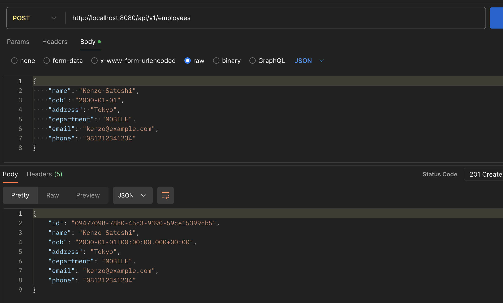
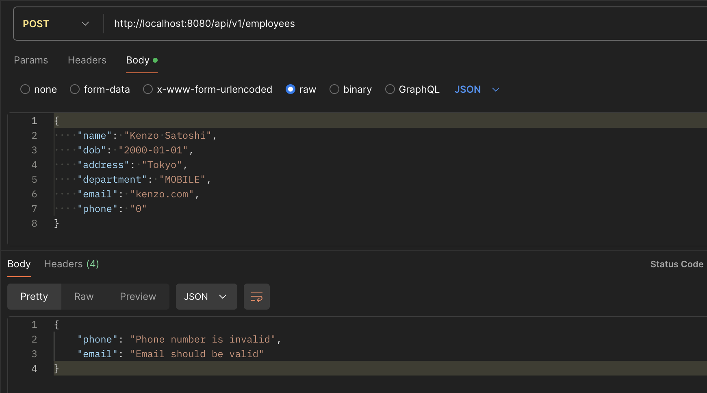
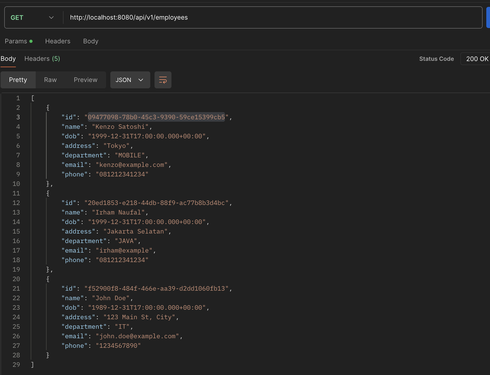
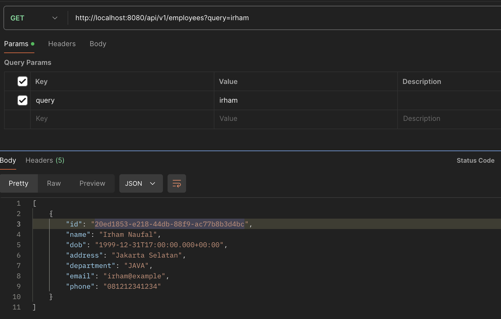
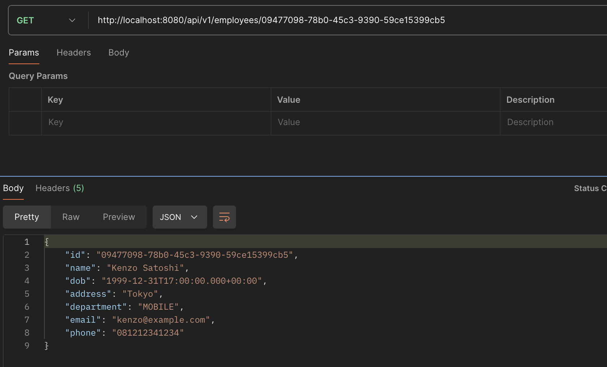
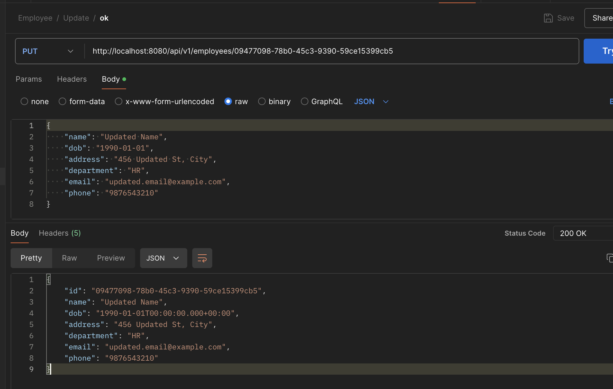
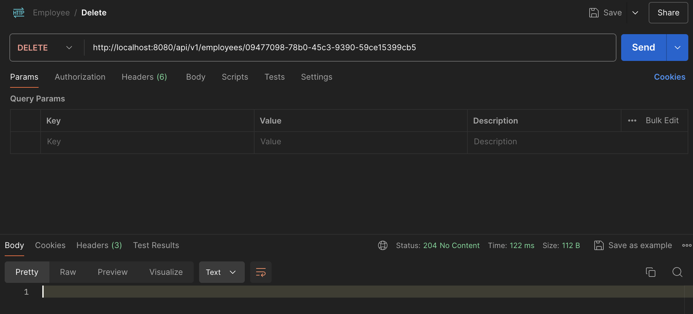

# SpringBoot REST API: Employee Management
On this project, we're going to explore how to create SpringBoot REST API with `DTO`, `Validation`, `ExceptionHandler`, and `Mapper`.

## Dependencies
Before we start, make sure to add some dependencies like `spring`, `jpa`, `mysql`, `lombok`, and `mapstruct.` You can see the full dependecies on the [pom.xml](lab/pom.xml) file.

## Create the Employee Table on Database
Create the `Employee` table on the MySQL database. You can input the SQL code below to create the table.
```sql
CREATE TABLE Employee (
    id CHAR(36) NOT NULL,
    name VARCHAR(255) NOT NULL,
    dob DATE NOT NULL,
    address VARCHAR(255) NOT NULL,
    department VARCHAR(255) NOT NULL,
    email VARCHAR(255) NOT NULL,
    phone VARCHAR(20) NOT NULL,
    PRIMARY KEY (id)
);
```

## Create the Employee Model
First, let's create the [Employee](lab/src/main/java/findo/lab/data/model/Employee.java) model class that represents the Employee entity in the database. This model will map directly to the `Employee` table.
```java
@Entity
@Data
public class Employee {

	@Id
    @GeneratedValue(strategy=GenerationType.UUID)
	private String id;
    private String name;
    private Date dob;
    private String address;
    private String department;
    private String email;
    private String phone;
}
```

## Create the Employee DTO
Next, we'll create a Data Transfer Object (DTO) for Employee. DTOs are used to transfer data between the application layers and provide a way to encapsulate the data. Here's the [code](lab/src/main/java/findo/lab/dto/EmployeeDTO.java).
```java
@Data
public class EmployeeDTO {
    private String id;

    @NotBlank(message = "Name is mandatory")
    private String name;

    @NotNull(message = "Date of birth is mandatory")
    @Past(message = "Date of birth must be a past date")
    private Date dob;

    @NotBlank(message = "Address is mandatory")
    private String address;

    @NotBlank(message = "Department is mandatory")
    private String department;

    @Email(message = "Email should be valid")
    @NotBlank(message = "Email is mandatory")
    private String email;

    @Pattern(regexp = "^\\+?[0-9. ()-]{7,25}$", message = "Phone number is invalid")
    @NotBlank(message = "Phone number is mandatory")
    private String phone;
}
```

## Create the Employee Repository
The repository layer is used to access the database. We'll create an [EmployeeRepository](lab/src/main/java/findo/lab/data/repository/EmployeeRepository.java) interface that extends `JpaRepository`.
```java
@Repository
public interface EmployeeRepository extends JpaRepository<Employee, String> {
    @Query("SELECT e FROM Employee e WHERE e.name LIKE %:query% OR e.address LIKE %:query% OR e.department LIKE %:query% OR e.email LIKE %:query% OR e.phone LIKE %:query%")
    List<Employee> searchEmployees(@Param("query") String query);
}
```
On this repository, because `JpaRepository` already handled basic CRUD, now we only add search query.

## Create the Employee Mapper
We use `MapStruct` to map between the `Employee` entity and the `EmployeeDTO`. The mapper will simplify the conversion process between the entity and DTO. Here's the [code](lab/src/main/java/findo/lab/mapper/EmployeeMapper.java).
```java
@Mapper(componentModel="spring")
public interface EmployeeMapper {
    EmployeeMapper INSTANCE = Mappers.getMapper(EmployeeMapper.class);

    EmployeeDTO employeeToEmployeeDTO(Employee employee);

    Employee employeeDTOToEmployee(EmployeeDTO employeeDTO);
}
```

## Create Exception Handler
Create custom exceptions and a global exception handler to manage errors in the application. 

### Custom Exceptions
Create a custom exception for when an employee is not found. Here's the [code](lab/src/main/java/findo/lab/exception/EmployeeNotFoundException.java).
```java
public class EmployeeNotFoundException extends RuntimeException {
    public EmployeeNotFoundException(String message) {
        super(message);
    }
}
```

### Global Exception Handler
Create a global exception handler to handle exceptions and return appropriate responses. Here's the [code](lab/src/main/java/findo/lab/exception/GlobalExceptionHandler.java).
```java
@ControllerAdvice
public class GlobalExceptionHandler {

    @ExceptionHandler(EmployeeNotFoundException.class)
    public ResponseEntity<?> employeeNotFoundException(EmployeeNotFoundException ex, WebRequest request) {
        ErrorDetails errorDetails = new ErrorDetails(new Date(), ex.getMessage(), request.getDescription(false));
        return new ResponseEntity<>(errorDetails, HttpStatus.NOT_FOUND);
    }

    @ExceptionHandler(MethodArgumentNotValidException.class)
    public ResponseEntity<?> handleValidationExceptions(MethodArgumentNotValidException ex) {
        Map<String, String> errors = new HashMap<>();
        ex.getBindingResult().getAllErrors().forEach((error) -> {
            String fieldName = ((FieldError) error).getField();
            String errorMessage = error.getDefaultMessage();
            errors.put(fieldName, errorMessage);
        });
        return new ResponseEntity<>(errors, HttpStatus.BAD_REQUEST);
    }

    @ExceptionHandler(Exception.class)
    public ResponseEntity<?> globalExceptionHandler(Exception ex, WebRequest request) {
        ErrorDetails errorDetails = new ErrorDetails(new Date(), ex.getMessage(), request.getDescription(false));
        return new ResponseEntity<>(errorDetails, HttpStatus.INTERNAL_SERVER_ERROR);
    }
}
```

## Implement the Rest
Next, you can implement the [Service](lab/src/main/java/findo/lab/service) and [Controller](lab/src/main/java/findo/lab/controller/EmployeeController.java) layer by following the code.

## Test it on Postman
To make an environment to test the APIs, you can copy and import this [JSON code](data/Employee.postman_collection.json) into your Postman.

### Create an Employee
We can create an employee by request the API with `POST` method, enpoint: `api/v1/employees`, and the body like on the picture.
#### Success


### Invalid


### Get Employees
We can get list of employees by hitting the endpoint: `api/v1/employees` with `GET` method. We also can add the `query` to do the searching logic.
### Without Query


### With Query to Search


## Get an Employee with ID
We can get an employee data by hitting the endpoint: `api/v1/employees/{EMPLOYEE_ID}` with `GET` method.


## Update an Employee
We can update an employee data by hitting the endpoint: `api/v1/employees/{EMPLOYEE_ID}` with `PUT` method.


## Delete an Employee
We can delete an employee data by hitting the endpoint: `api/v1/employees/{EMPLOYEE_ID}` with `DELETE` method.
