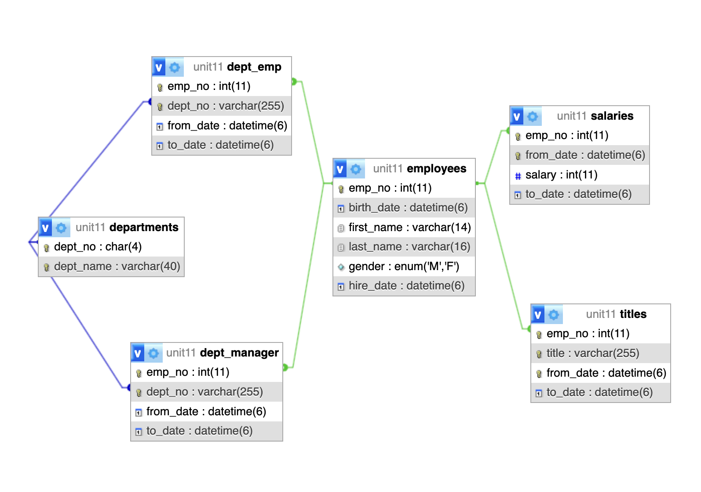
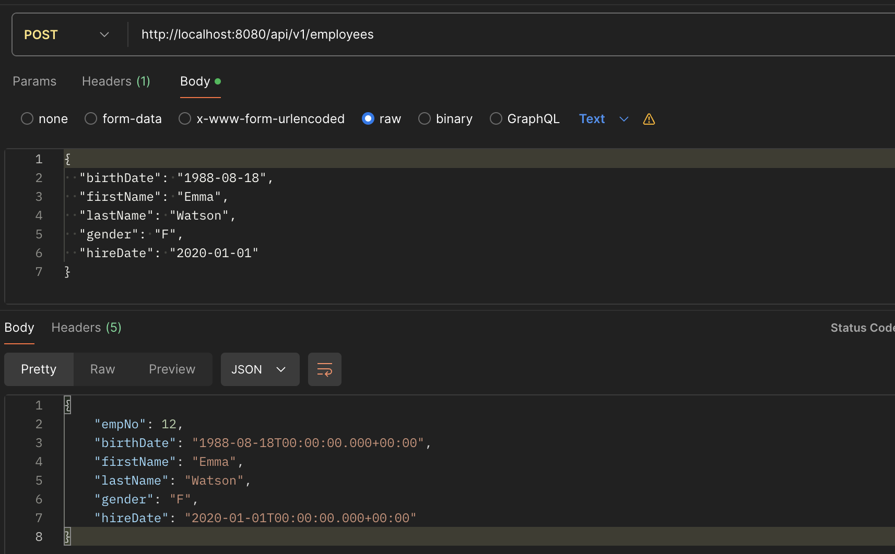
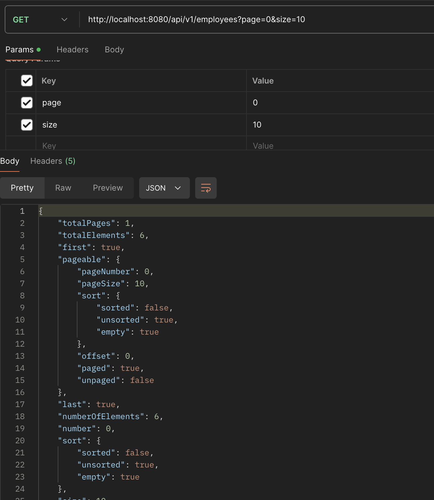
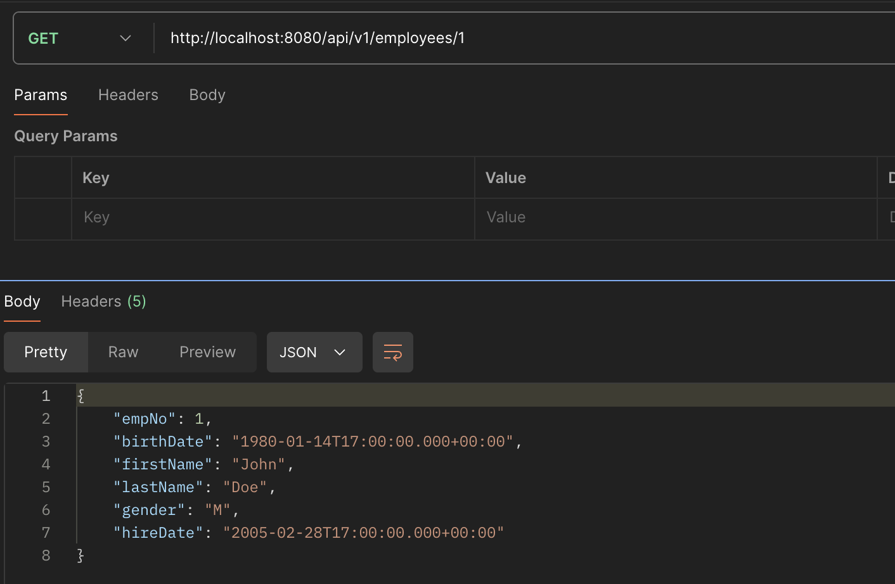
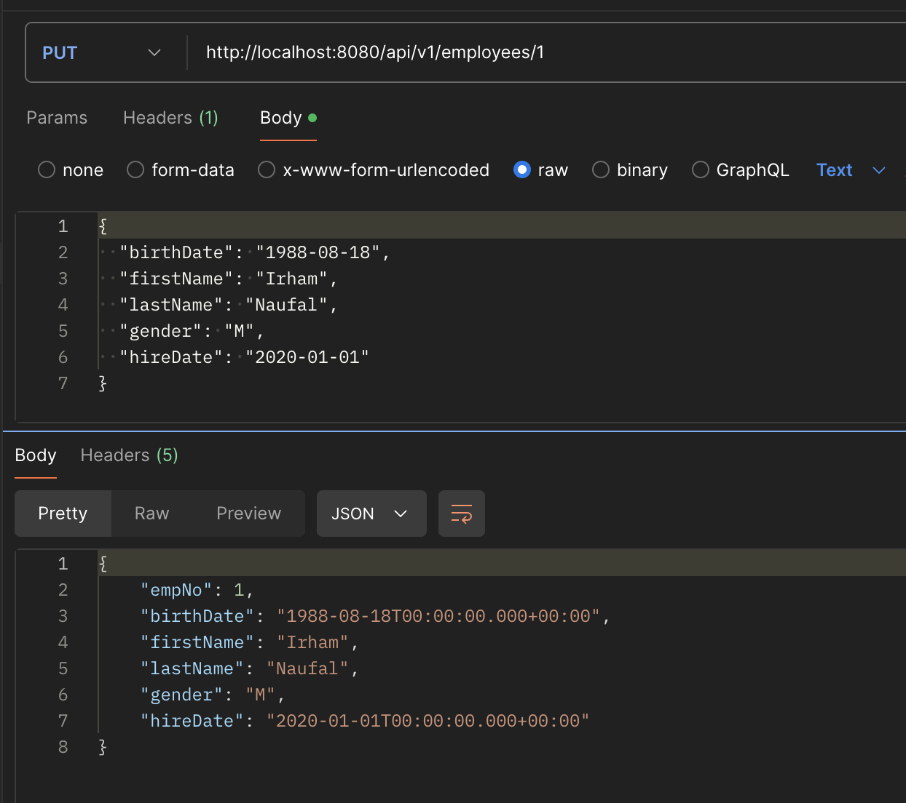
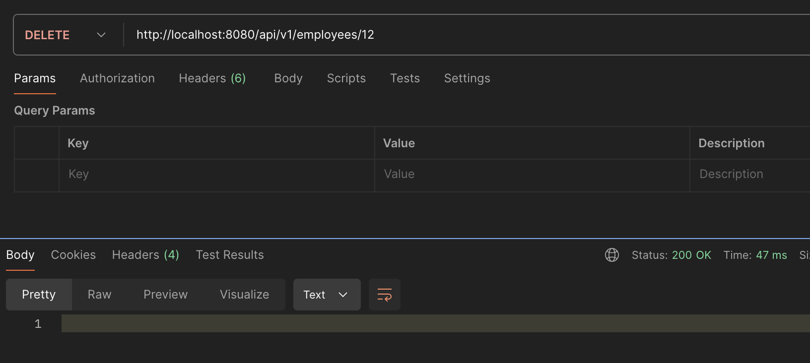

# Assignment 1: Company Management with Spring Data JPA

On this assignment, I explored the Spring JPA framework to create REST API with multiple table, and with composite key. You can check the full code [here](lab/src/main/java/findo/lab).

## ERD


## Composite Key Example
A composite key is a key that consists of two or more columns. It is used to uniquely identify a record in the table. In the context of JPA and Hibernate, a composite key can be represented using the `@Embeddable` and `@EmbeddedId` annotations.

### [DeptManager Entity](lab/src/main/java/findo/lab/data/entity/DeptManager.java)
Below is the code for the `DeptManager` entity, which maps to the `dept_manager` table in the database.

```java
@Entity
@Table(name="dept_manager")
@Data
public class DeptManager {
    @EmbeddedId
    private DeptManagerId id;

    @Column(nullable = false)
    private Date fromDate;

    @Column(nullable = false)
    private Date toDate;

    @Embeddable
    @Data
    public static class DeptManagerId implements Serializable {
        private Integer empNo;
        private String deptNo;
    }
}
```
#### Explanation
- **Entity Annotation**: The `@Entity` annotation specifies that the class is an entity and is mapped to a database table. The `@Table` annotation specifies the name of the database table to be used for mapping.

- **EmbeddedId Annotation**: The `@EmbeddedId` annotation is used to denote a composite primary key. It is applied to a field or property of an entity class that is an instance of an embeddable class.

- **Column Annotations**: The `@Column` annotation is used to specify the mapped column for a persistent property or field. In this case, `fromDate` and `toDate` columns are non-nullable.

- **Embeddable Annotation**: The `@Embeddable` annotation is used to specify that a class will be embedded by other entities. In this case, `DeptManagerId` is an embeddable class that represents the composite key.

- **Serializable Interface**: The `Serializable` interface is implemented to allow the composite key class to be used as an identifier. This is necessary because JPA requires that composite key classes must be serializable.

- **DeptManagerId Class**: This is the class that defines the composite key. It contains two fields: `empNo` (employee number) and `deptNo` (department number). These fields together form the composite key for the `dept_manager` table.

This structure allows us to uniquely identify a record in the `dept_manager` table using a combination of `empNo` and `deptNo`.

## Test the REST API on Postman
You can import the postman collection [here](src/Company%20Management.postman_collection.json). Here's some examples of the usage on Postman.

#### Create Employee


#### Get Employees


#### Get an Employee by ID


#### Update an Employee


#### Delete an Employee
