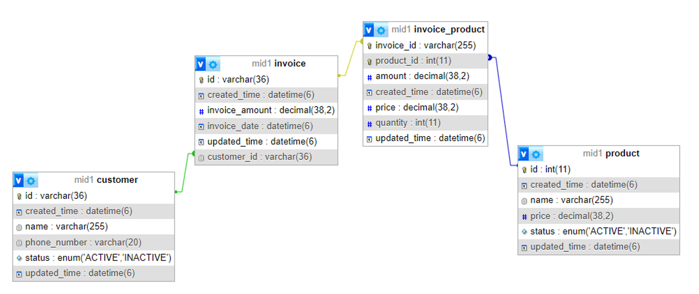
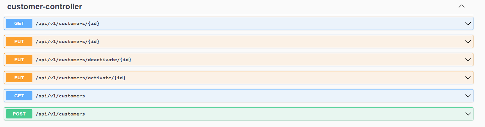
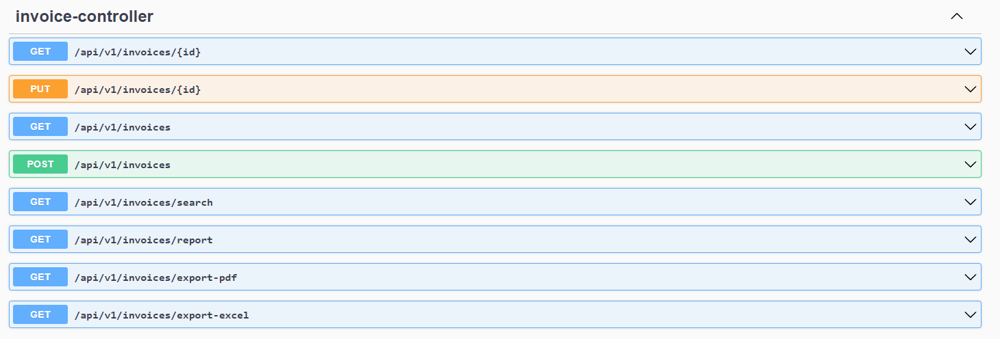
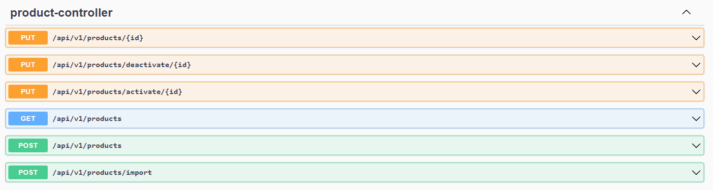

## Midterm Exam Group 1: POS Management API

### Overview
This project is a simple web application built using Spring Boot for managing customers, products and invoices. It provides basic CRUD functionalities (Create, Read, Update, Delete) for entities stored in a MySQL database and some other functionalities.

### Technologies Used
- **Spring Boot**: Framework for creating and running Spring-based applications.
- **MySQL**: Open-source relational database management system.
- **Swagger (Springdoc OpenAPI)**: For API documentation.
- **Apache POI**: Java API for Microsoft documents.
- **Lombok**: Java library to reduce boilerplate code.
- **iTextPDF**: Java library for creating and manipulating PDF documents.

### Prerequisites
- Java 21 or higher
- Maven 3.6.0 or higher
- MySQL 8.0 or higher

### Database Design

### Running the Application
1. Create MySQL database named midtermg1, configure the username and password in the `application.properties`
2. Execute `mvn spring-boot:run` in the project directory
3. The application will be accessible at `http://localhost:8080`

### API List
When the app is running, the API list can be seen at `http://localhost:8080/swagger-ui/index.html`

### Insert Inital Data
For initial data, use [init.sql](file%2Finit.sql)

### Example Data
Example data is available on [file](file)

### Member
| GitHub                                                               | Name                            |
|----------------------------------------------------------------------|---------------------------------|
| [manuellaiv](https://github.com/manuellaiv)                          | Manuella Ivana Uli Sianipar     |
| [irhamnaufal8](https://github.com/irhamnaufal8)                      | Muhammad Irham Naufal Al Machdi |
| [ryuzakijebi](https://github.com/ryuzakijebi)                                              | Jebi Hendardi                   |

#
### API List

#### Customer APIs

| Action               | Method | URL                                                       | Params/Body                      |
|----------------------|--------|-----------------------------------------------------------|----------------------------------|
| Get Customer List    | GET    | `http://localhost:8080/api/v1/customers`                  | `page`, `size`, `keyword` (optional) |
| Get Customer by ID   | GET    | `http://localhost:8080/api/v1/customers/{id}`             | Replace `{id}` with customer ID  |
| Add Customer         | POST   | `http://localhost:8080/api/v1/customers`                  | JSON body with customer data     |
| Edit Customer        | PUT    | `http://localhost:8080/api/v1/customers/{id}`             | Replace `{id}` with customer ID, JSON body with updated data |
| Activate Customer    | PUT    | `http://localhost:8080/api/v1/customers/activate/{id}`    | Replace `{id}` with customer ID  |
| Deactivate Customer  | PUT    | `http://localhost:8080/api/v1/customers/deactivate/{id}`  | Replace `{id}` with customer ID  |
#
### Invoice APIs

| Action                 | Method | URL                                                        | Params/Body                       |
|------------------------|--------|------------------------------------------------------------|-----------------------------------|
| Add Invoice            | POST   | `http://localhost:8080/api/v1/invoices`                    | JSON body with invoice data       |
| Edit Invoice           | PUT    | `http://localhost:8080/api/v1/invoices/{id}`               | Replace `{id}` with invoice ID, JSON body with updated data |
| Get Invoice by ID      | GET    | `http://localhost:8080/api/v1/invoices/{id}`               | Replace `{id}` with invoice ID    |
| Get All Invoices       | GET    | `http://localhost:8080/api/v1/invoices`                    | `page`, `size`                    |
| Add Invoice Product    | POST   | `http://localhost:8080/api/v1/invoices/products`           | JSON body with invoice product data |
| Search Invoices        | GET    | `http://localhost:8080/api/v1/invoices/search`             | `customerId`, `customerName`, `year`, `month`, `invoiceAmountCondition`, `invoiceAmount`, `page`, `size` |
| Export Invoices to PDF | GET    | `http://localhost:8080/api/v1/invoices/export-pdf`         | None                              |
| Export Invoices to Excel | GET  | `http://localhost:8080/api/v1/invoices/export-excel`       | `customerId`, `customerName`, `year`, `month`, `invoiceAmountCondition`, `invoiceAmount` |
| Get Revenue Report     | GET    | `http://localhost:8080/api/v1/invoices/report`             | `year`, `month`, `day`            |
#
### Product APIs

| Action               | Method | URL                                                       | Params/Body                      |
|----------------------|--------|-----------------------------------------------------------|----------------------------------|
| Get All Products     | GET    | `http://localhost:8080/api/v1/products`                   | `page`, `size`, `search`, `sortBy`, `sortDir` |
| Add Product          | POST   | `http://localhost:8080/api/v1/products`                   | JSON body with product data      |
| Edit Product         | PUT    | `http://localhost:8080/api/v1/products/{id}`              | Replace `{id}` with product ID, JSON body with updated data |
| Import Products      | POST   | `http://localhost:8080/api/v1/products/import`            | `form-data` key `file` with file upload |
| Activate Product     | PUT    | `http://localhost:8080/api/v1/products/activate/{id}`     | Replace `{id}` with product ID   |
| Deactivate Product   | PUT    | `http://localhost:8080/api/v1/products/deactivate/{id}`   | Replace `{id}` with product ID   |
